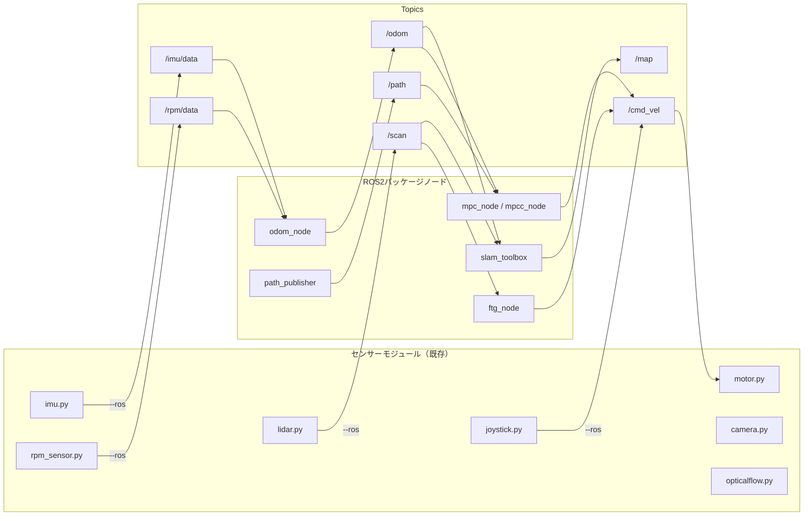

# ROS2 対応

## 概要

togikaidriveの各センサーモジュールをROS2ノードとして起動し、標準的なROSトピックでデータを配信できます。
さらにROS2専用パッケージ `togikaidrive_ros` を追加し、SLAM・Follow the Gap・MPC・MPCCによる自律走行を実現します。

### アーキテクチャ

```
togikaidrive-dev/
├── motor.py, lidar.py, imu.py ...   ← 既存モジュール (python3 <module>.py --ros)
│
└── togikaidrive_ros/                  ← ROS2専用パッケージ (ament_python)
    ├── package.xml, setup.py
    ├── togikaidrive_ros/
    │   ├── odom_node.py               ← オドメトリ算出
    │   ├── ftg_node.py                ← Follow the Gap 障害物回避走行
    │   ├── mpc_controller.py          ← MPC経路追従制御
    │   ├── mpcc_controller.py         ← MPCC最速走行制御
    │   └── path_publisher.py          ← ウェイポイント発行
    ├── launch/
    │   ├── drive.launch.py            ← run.py相当
    │   ├── slam.launch.py             ← SLAM地図生成
    │   ├── localization.launch.py     ← 自己位置推定（AMCL / slam_toolbox）
    │   ├── ftg.launch.py              ← Follow the Gap 自律走行
    │   ├── mpc.launch.py              ← MPC走行
    │   └── mpcc.launch.py             ← MPCC走行
    └── config/
        ├── vehicle_params.yaml        ← 車両・制御パラメータ
        └── slam_params.yaml           ← SLAM Toolbox設定
```

各モジュールは `--ros` フラグなしでも従来どおりスタンドアロンで動作します。ROS2がインストールされていない環境でも既存機能に影響はありません。

---

## セットアップ

### 1. ROS2 インストール

#### Jetson Orin Nano — ROS2 Humble

Jetson Orin NanoはUbuntu 22.04ベースのため、**ROS2 Humble Hawksbill**（LTS, 2027年5月EOL）を使用します。

```bash
# ロケール設定
sudo apt update && sudo apt install locales
sudo locale-gen en_US en_US.UTF-8
sudo update-locale LC_ALL=en_US.UTF-8 LANG=en_US.UTF-8
export LANG=en_US.UTF-8

# ROS2リポジトリ追加
sudo apt install software-properties-common
sudo add-apt-repository universe
sudo apt update && sudo apt install curl -y
sudo curl -sSL https://raw.githubusercontent.com/ros/rosdistro/master/ros.key \
  -o /usr/share/keyrings/ros-archive-keyring.gpg
echo "deb [arch=$(dpkg --print-architecture) signed-by=/usr/share/keyrings/ros-archive-keyring.gpg] \
  http://packages.ros.org/ros2/ubuntu $(. /etc/os-release && echo $UBUNTU_CODENAME) main" | \
  sudo tee /etc/apt/sources.list.d/ros2.list > /dev/null

# インストール
sudo apt update
sudo apt install ros-humble-desktop
```

#### Raspberry Pi 5 — ROS2 Jazzy

Raspberry Pi 5はUbuntu 24.04ベースのため、**ROS2 Jazzy Jalisco**（LTS, 2029年5月EOL）を使用します。

```bash
# ロケール設定
sudo apt update && sudo apt install locales
sudo locale-gen en_US en_US.UTF-8
sudo update-locale LC_ALL=en_US.UTF-8 LANG=en_US.UTF-8
export LANG=en_US.UTF-8

# ROS2リポジトリ追加
sudo apt install software-properties-common
sudo add-apt-repository universe
sudo apt update && sudo apt install curl -y
sudo curl -sSL https://raw.githubusercontent.com/ros/rosdistro/master/ros.key \
  -o /usr/share/keyrings/ros-archive-keyring.gpg
echo "deb [arch=$(dpkg --print-architecture) signed-by=/usr/share/keyrings/ros-archive-keyring.gpg] \
  http://packages.ros.org/ros2/ubuntu $(. /etc/os-release && echo $UBUNTU_CODENAME) main" | \
  sudo tee /etc/apt/sources.list.d/ros2.list > /dev/null

# インストール
sudo apt update
sudo apt install ros-jazzy-desktop
```

#### 環境設定

```bash
# .bashrc に追加（Humbleの場合）
echo "source /opt/ros/humble/setup.bash" >> ~/.bashrc
source ~/.bashrc
```

### 2. 追加パッケージのインストール

```bash
# Humbleの場合
sudo apt install ros-humble-sensor-msgs ros-humble-std-msgs \
  ros-humble-geometry-msgs ros-humble-nav-msgs \
  ros-humble-tf2-ros ros-humble-slam-toolbox

# Jazzyの場合
sudo apt install ros-jazzy-sensor-msgs ros-jazzy-std-msgs \
  ros-jazzy-geometry-msgs ros-jazzy-nav-msgs \
  ros-jazzy-tf2-ros ros-jazzy-slam-toolbox
```

### 3. togikaidrive_ros パッケージのビルド

```bash
cd ~/projects/togikaidrive-dev
source /opt/ros/humble/setup.bash   # Jazzyの場合は jazzy
colcon build --packages-select togikaidrive_ros
source install/setup.bash
```

---

## トピック・TF 構成

### トピック一覧



| モジュール | ノード名 | トピック | メッセージ型 | 方向 |
|-----------|---------|---------|-------------|------|
| `motor.py` | `motor_node` | `/cmd_vel` | `geometry_msgs/Twist` | Subscribe |
| `lidar.py` | `lidar_node` | `/scan` | `sensor_msgs/LaserScan` | Publish |
| `imu.py` | `imu_node` | `/imu/data` | `sensor_msgs/Imu` | Publish |
| `rpm_sensor.py` | `rpm_node` | `/rpm/data` | `std_msgs/Float32MultiArray` | Publish |
| `joystick.py` | `joystick_node` | `/cmd_vel`, `/joy/mode` | `Twist`, `String` | Publish |
| `camera.py` | `camera_node` | `/camera0/image_raw` | `sensor_msgs/Image` | Publish |
| `opticalflow.py` | `opticalflow_node` | `/opticalflow/data` | `std_msgs/Float32MultiArray` | Publish |
| `odom_node` | `odom_node` | `/odom` | `nav_msgs/Odometry` | Publish |
| `path_publisher` | `path_publisher_node` | `/path` | `nav_msgs/Path` | Publish |
| `ftg_node` | `ftg_node` | `/cmd_vel` | `geometry_msgs/Twist` | Publish |
| `ftg_node` | `ftg_node` | `/ftg/target_pose` | `geometry_msgs/PoseStamped` | Publish |
| `ftg_node` | `ftg_node` | `/ftg/status` | `visualization_msgs/Marker` | Publish |
| `mpc_node` | `mpc_node` | `/cmd_vel` | `geometry_msgs/Twist` | Publish |
| `mpc_node` | `mpc_node` | `/mpc/predicted_path` | `nav_msgs/Path` | Publish |
| `mpc_node` | `mpc_node` | `/mpc/status` | `visualization_msgs/Marker` | Publish |
| `mpcc_node` | `mpcc_node` | `/cmd_vel` | `geometry_msgs/Twist` | Publish |

### TFツリー

```
map                         (slam_toolbox が発行)
 └── odom                   (slam_toolbox が発行)
      └── base_link         (odom_node が発行)
           ├── lidar_link   (lidar_node が Static TF 発行)
           ├── imu_link     (imu_node が TF 発行)
           └── camera0_link (camera_node が使用するframe_id)
```

---

## Launch ファイル

### drive.launch.py — 通常走行（run.py 相当）

`config.py` の `ACTIVE_SENSORS` に基づいて必要なノードを自動起動します。

```bash
ros2 launch togikaidrive_ros drive.launch.py
```

起動されるノード:

| ノード | 条件 | 遅延 |
|--------|------|------|
| motor_node | 常時 | 0s |
| lidar_node | `'lidar' in ACTIVE_SENSORS` | 0.5s |
| imu_node | `'imu' in ACTIVE_SENSORS` | 1.0s |
| rpm_node | `'rpm' in ACTIVE_SENSORS` | 1.0s |
| opticalflow_node | `'optical_flow' in ACTIVE_SENSORS` | 1.0s |
| camera_node | `'camera_0'` or `'camera_1'` | 2.0s |
| odom_node | `'imu'` and `'rpm'` | 3.0s |
| joystick / pwm_controller | CONTROLLER_TYPE | 1.5s |
| planner_node | 常時 | 4.0s |

### slam.launch.py — SLAM地図生成

LiDAR + IMU + RPM + オドメトリ + slam_toolbox でリアルタイム地図生成を行います。

```bash
ros2 launch togikaidrive_ros slam.launch.py
```

| ノード | 遅延 |
|--------|------|
| lidar_node | 0s |
| imu_node | 1.0s |
| rpm_node | 1.0s |
| odom_node | 3.0s |
| slam_toolbox (mapping) | 5.0s |

地図の保存:

```bash
ros2 run nav2_map_server map_saver_cli -f ~/maps/course_map
```

### localization.launch.py — 自己位置推定

保存済みマップを使った自己位置推定を行います。AMCL と slam_toolbox の2手法を切り替え可能です。

```bash
# AMCL（デフォルト、軽量高速）
ros2 launch togikaidrive_ros localization.launch.py

# slam_toolbox（高精度、計算重め）
ros2 launch togikaidrive_ros localization.launch.py method:=slam_toolbox

# マップ指定
ros2 launch togikaidrive_ros localization.launch.py map_path:=maps/other_map
```

| ノード | 遅延 |
|--------|------|
| lidar_node | 0s |
| imu_node | 1.0s |
| rpm_node | 1.0s |
| optical_flow_node | 1.5s |
| odom_node | 3.0s |
| map_server + amcl / slam_toolbox | 5.0s |

### ftg.launch.py — Follow the Gap 自律走行

LiDARスキャンから最も広いギャップ（障害物のない空間）を見つけて走行します。
ウェイポイント不要で、地図と自己位置推定があればすぐに自律走行できます。

```bash
# AMCL localization + Follow the Gap
ros2 launch togikaidrive_ros ftg.launch.py

# slam_toolbox localization
ros2 launch togikaidrive_ros ftg.launch.py method:=slam_toolbox
```

| ノード | 遅延 |
|--------|------|
| motor_node | 0s |
| lidar_node | 0.5s |
| imu_node | 1.0s |
| rpm_node | 1.0s |
| optical_flow_node | 1.5s |
| odom_node | 3.0s |
| localization (amcl / slam_toolbox) | 5.0s |
| ftg_node | 8.0s |

### mpc.launch.py — MPC経路追従走行

事前に生成した地図を使い、MPC（Model Predictive Control）で経路追従走行を行います。

```bash
ros2 launch togikaidrive_ros mpc.launch.py
```

| ノード | 遅延 |
|--------|------|
| motor_node | 0s |
| lidar_node | 0.5s |
| imu_node | 1.0s |
| rpm_node | 1.0s |
| odom_node | 3.0s |
| slam_toolbox (localization) | 5.0s |
| path_publisher | 6.0s |
| mpc_node | 7.0s |

### mpcc.launch.py — MPCC最速走行

MPCCで経路をなぞりつつラップタイム最小化を目指す走行を行います。

```bash
ros2 launch togikaidrive_ros mpcc.launch.py
```

ノード構成はMPCと同じですが、`mpc_node` の代わりに `mpcc_node` が起動されます。

---

## ROS2 パッケージノード

### odom_node — オドメトリ算出

IMU（角速度）とRPMセンサー（車輪速度）からオドメトリを算出します。

| 項目 | 内容 |
|------|------|
| Subscribe | `/imu/data` (Imu), `/rpm/data` (Float32MultiArray) |
| Publish | `/odom` (Odometry) |
| TF | `odom` → `base_link` |
| 更新レート | 50Hz |

```bash
ros2 run togikaidrive_ros odom_node
```

### ftg_node — Follow the Gap 障害物回避走行

LiDARスキャンデータから最も広いギャップを見つけ、その方向に車両を向ける自律走行ノードです。
既存の `follow_the_gap.py` の `FollowTheGap` クラスをROS2ノードとしてラップしています。

| 項目 | 内容 |
|------|------|
| Subscribe | `/scan` (LaserScan) |
| Publish | `/cmd_vel` (Twist) — `angular.z`=steering, `linear.x`=throttle |
| Publish | `/ftg/target_pose` (PoseStamped) — ギャップ目標方向（rviz2 矢印表示） |
| Publish | `/ftg/target_angle` (Float32) — ギャップ目標角度（度） |
| Publish | `/ftg/status` (Marker) — steering/throttle テキスト表示 |
| 制御レート | 20Hz |

**アルゴリズムの流れ:**

1. LiDARデータの前処理（無効値除去、前方角度抽出）
2. 最も近い障害物を検出
3. 安全バブルを適用（障害物周辺を通行不可に）
4. 距離の不連続点を拡張（安全マージン確保）
5. 最も広いギャップを選択（幅 × 距離 × 中央ボーナス）
6. ステアリング計算（linear / PID / pure_pursuit 切替可能）
7. スロットル計算（ステアリング量に応じて減速）

**ステアリング方式:**

| 方式 | 説明 |
|------|------|
| `linear` | 目標角度を線形マッピング（デフォルト） |
| `pid` | PID制御で目標角度0°に追従 |
| `pure_pursuit` | 幾何学的追従、目標距離に応じた曲率計算 |

```bash
ros2 run togikaidrive_ros ftg_node --ros-args --params-file config/vehicle_params.yaml
```

### mpc_node — MPC経路追従制御

自転車モデル（Kinematic Bicycle Model）に基づくMPCコントローラーです。

| 項目 | 内容 |
|------|------|
| Subscribe | `/odom` (Odometry), `/path` (Path) |
| Publish | `/cmd_vel` (Twist) |
| Publish | `/mpc/predicted_path` (Path) — N ステップ予測軌道（rviz2 表示） |
| Publish | `/mpc/status` (Marker) — steering/throttle/速度 テキスト表示 |
| ソルバー | scipy SLSQP |
| 制御レート | 20Hz |

**動力学モデル（Kinematic Bicycle Model）**

| 状態変数 | 記号 | 説明 |
|---------|------|------|
| 位置X | $x$ | グローバル座標X |
| 位置Y | $y$ | グローバル座標Y |
| ヨー角 | $\psi$ | 車両の向き |
| 速度 | $v$ | 前進速度 |

| 制御入力 | 記号 | 説明 |
|---------|------|------|
| ステアリング角 | $\delta$ | 前輪操舵角 |
| 加速度 | $a$ | 加減速 |

**コスト関数**

| コスト項 | 重み | 説明 |
|---------|------|------|
| 位置追従誤差 | `w_pos` (10.0) | 参照経路からの位置偏差 |
| ヨー角追従誤差 | `w_heading` (5.0) | 参照経路との角度偏差 |
| ステアリング | `w_steer` (1.0) | 操舵入力の大きさ制限 |
| スロットル | `w_throttle` (0.5) | 加減速入力の大きさ制限 |
| ステアリング変化率 | `w_steer_rate` (5.0) | 急激な操舵を抑制 |
| スロットル変化率 | `w_throttle_rate` (2.0) | 急激な加減速を抑制 |

```bash
ros2 run togikaidrive_ros mpc_node --ros-args --params-file config/vehicle_params.yaml
```

### mpcc_node — MPCC最速走行制御

MPCを拡張し、経路上の**進行度（progress）を最大化**することでラップタイム最小化を実現します。

| 項目 | 内容 |
|------|------|
| Subscribe | `/odom` (Odometry), `/path` (Path) |
| Publish | `/cmd_vel` (Twist) |
| ソルバー | scipy SLSQP |
| 経路補間 | CubicSpline（周期的スプライン） |
| 制御レート | 20Hz |

**MPCとMPCCの比較**

| 項目 | MPC | MPCC |
|------|-----|------|
| 目的 | 経路への正確な追従 | 最速でのコース走破 |
| 状態変数 | [x, y, ψ, v] | [x, y, ψ, v] + 進行度θ |
| 評価関数 | 位置誤差 + 制御コスト | コンタリング誤差 + ラグ誤差 + 進行度報酬 |
| 速度制御 | 目標速度への追従 | コーナーで自動減速、直線で自動加速 |
| 適用場面 | 安全な自律走行 | レース・タイムアタック |

**MPCCのコスト関数**

$$J = \sum_{k=0}^{N} (q_c \cdot e_c^2 + q_l \cdot e_l^2 - q_\theta \cdot d\theta) + \text{入力ペナルティ}$$

| コスト項 | 記号 | 重み | 説明 |
|---------|------|------|------|
| コンタリング誤差 | $e_c$ | `q_contour` (20.0) | 経路に対する横方向の偏差 |
| ラグ誤差 | $e_l$ | `q_lag` (10.0) | 経路上の最近接点からの遅れ |
| 進行度報酬 | $-d\theta$ | `q_progress` (8.0) | 経路上の進行速度（最大化） |
| ステアリング | | `w_steer` (1.0) | 操舵入力の滑らかさ |
| スロットル | | `w_throttle` (0.5) | 加減速入力の滑らかさ |

```bash
ros2 run togikaidrive_ros mpcc_node --ros-args --params-file config/vehicle_params.yaml
```

### path_publisher — ウェイポイント発行

SLAMで生成したマップ上のウェイポイントを `/path` として発行します。

| 項目 | 内容 |
|------|------|
| Publish | `/path` (nav_msgs/Path) |
| frame_id | `map` |
| 発行レート | 1Hz |

ウェイポイントはJSONファイルから読み込むか、デフォルトの楕円形パスを使用します。

```json
// waypoints.json の形式
[
    {"x": 0.0, "y": 0.0, "theta": 0.0},
    {"x": 1.0, "y": 0.5, "theta": 0.78},
    {"x": 2.0, "y": 0.0, "theta": 0.0}
]
```

```bash
# デフォルト楕円パスで起動
ros2 run togikaidrive_ros path_publisher

# JSONファイルからウェイポイントを読み込んで起動
python3 togikaidrive_ros/togikaidrive_ros/path_publisher.py --ros --file waypoints.json
```

---

## パラメータ設定

### vehicle_params.yaml

MPC / MPCC / オドメトリの全パラメータを `togikaidrive_ros/config/vehicle_params.yaml` で管理します。
launch ファイルから自動的に読み込まれます。

```yaml
# --- MPC パラメータ ---
mpc_node:
  ros__parameters:
    wheelbase: 0.45        # 前後輪間距離 (m)
    max_speed: 2.0          # 最大速度 (m/s)
    max_steering: 1.0       # ステアリング正規化上限
    max_throttle: 1.0       # スロットル正規化上限
    horizon: 10             # 予測ホライゾン
    dt: 0.1                 # 予測ステップ間隔 (s)
    w_pos: 10.0             # 位置追従コスト
    w_heading: 5.0          # ヨー角追従コスト
    w_steer: 1.0            # ステアリング入力コスト
    w_throttle: 0.5         # スロットル入力コスト
    w_steer_rate: 5.0       # ステアリング変化率コスト
    w_throttle_rate: 2.0    # スロットル変化率コスト
    max_iter: 50            # ソルバー最大反復回数

# --- MPCC パラメータ ---
mpcc_node:
  ros__parameters:
    wheelbase: 0.45
    max_speed: 2.0
    max_steering: 1.0
    max_throttle: 1.0
    horizon: 10
    dt: 0.1
    q_contour: 20.0         # 横方向逸脱ペナルティ
    q_lag: 10.0              # 縦方向遅れペナルティ
    q_progress: 8.0          # 進行速度ボーナス（大→速い）
    w_steer: 1.0
    w_throttle: 0.5
    w_steer_rate: 3.0
    w_dtheta_rate: 1.0
    max_dtheta: 0.5          # 1ステップ最大進行量
    max_iter: 50

# --- Follow the Gap パラメータ ---
ftg_node:
  ros__parameters:
    safety_distance: 0.3      # 安全距離 (m)
    max_distance: 3.0          # 最大検出距離 (m)
    bubble_radius: 0.15        # 安全バブル半径 (m)
    disparity_threshold: 0.2   # 距離差閾値 (m)
    steering_gain: 1.0         # ステアリングゲイン
    smoothing_factor: 0.3      # EMAスムージング係数
    steering_method: 'linear'  # linear / pid / pure_pursuit
    max_throttle: 0.3          # 直線時スロットル
    corner_throttle: 0.2       # コーナー時スロットル
```

### slam_params.yaml

slam_toolbox のパラメータは `togikaidrive_ros/config/slam_params.yaml` で設定します。
ミニカー + LiDARに合わせてチューニング済みです。

主要設定:

| パラメータ | 値 | 説明 |
|-----------|-----|------|
| `resolution` | 0.02 | 地図解像度 2cm/ピクセル |
| `minimum_travel_distance` | 0.05 | スキャン追加最小移動距離 |
| `minimum_travel_heading` | 0.05 | スキャン追加最小回転角 |
| `max_laser_range` | 20.0 | LiDAR最大距離 (m) |
| `do_loop_closing` | true | ループクロージング有効 |

---

## センサーモジュール個別起動

各モジュールを個別にROS2モードで起動することもできます。

```bash
# LiDAR
python3 lidar.py --ros

# IMU
python3 imu.py --ros

# RPMセンサー
python3 rpm_sensor.py --ros

# モーター
python3 motor.py --ros

# ジョイスティック
python3 joystick.py --ros

# カメラ
python3 camera.py --ros

# オプティカルフロー
python3 opticalflow.py --ros
```

トピック確認:

```bash
# アクティブなトピック一覧
ros2 topic list

# データ確認
ros2 topic echo /scan
ros2 topic echo /imu/data
ros2 topic echo /odom

# 配信レート確認
ros2 topic hz /scan
```

### 設計方針

各モジュールは以下の共通パターンで実装されています。

```python
# ROS2が利用可能な場合のみノードクラスを定義
try:
    import rclpy
    from rclpy.node import Node
    ...
    class SensorNode(Node):
        ...
    def main_ros():
        ...
except ImportError:
    rclpy = None

# --ros フラグで起動モードを切り替え
if __name__ == "__main__":
    parser = argparse.ArgumentParser()
    parser.add_argument('--ros', action='store_true')
    args = parser.parse_args()
    if args.ros and rclpy:
        main_ros()
    else:
        main()
```

- ROS2未インストール環境では `rclpy = None` となり、既存動作に影響なし
- `--ros` フラグなしでは従来どおりスタンドアロン実行
- 各ノードは `create_timer` による一定周期パブリッシュ

---

## 使い方ガイド

### Step 1: SLAMで地図を作成

```bash
# 1. SLAMを起動
ros2 launch togikaidrive_ros slam.launch.py

# 2. 別ターミナルでジョイスティックを起動して手動走行
python3 joystick.py --ros

# 3. コースを1〜2周走行

# 4. 地図を保存
ros2 run nav2_map_server map_saver_cli -f ~/maps/course_map
```

### Step 2: Follow the Gap で自律走行（ウェイポイント不要）

地図と自己位置推定があれば、ウェイポイントなしですぐに自律走行できます。
LiDARで障害物を避けながら最も開けた方向に走行します。

```bash
ros2 launch togikaidrive_ros ftg.launch.py
```

### Step 3: ウェイポイントを記録

SLAMで生成された地図上の座標を使ってウェイポイントのJSONファイルを作成します。

```json
[
    {"x": 0.0, "y": 0.0, "theta": 0.0},
    {"x": 0.5, "y": 0.0, "theta": 0.0},
    {"x": 1.0, "y": 0.3, "theta": 0.5},
    {"x": 1.2, "y": 0.8, "theta": 1.57},
    {"x": 1.0, "y": 1.3, "theta": 2.6},
    {"x": 0.5, "y": 1.5, "theta": 3.14},
    {"x": 0.0, "y": 1.3, "theta": -2.6},
    {"x": -0.2, "y": 0.8, "theta": -1.57},
    {"x": 0.0, "y": 0.3, "theta": -0.5}
]
```

### Step 4: MPC で経路追従走行

```bash
ros2 launch togikaidrive_ros mpc.launch.py
```

### Step 5: MPCC で最速走行

```bash
ros2 launch togikaidrive_ros mpcc.launch.py
```

### パラメータチューニング

**Follow the Gap: チューニング**
- `safety_distance` を大きくする → 障害物からの距離を広くとる（安全重視）
- `max_throttle` / `corner_throttle` を調整 → 走行速度の制御
- `steering_method` を `pid` や `pure_pursuit` に変更 → ステアリング特性の変更
- `smoothing_factor` を大きくする → ステアリングの応答が速くなる（0〜1）

**MPC: 追従精度を上げたい場合**
- `w_pos` を大きくする → 経路からの偏差を強く制限
- `w_heading` を大きくする → ヨー角の偏差を強く制限
- `w_steer_rate` を大きくする → 滑らかなステアリング

**MPCC: 速度を重視したい場合**
- `q_progress` を大きくする → より速く進もうとする
- `q_contour` を小さくする → 横方向逸脱の許容度が上がる

**MPCC: 安全性を重視したい場合**
- `q_contour` を大きくする → 横方向逸脱を厳しく制限
- `q_progress` を小さくする → 速度より安定性を優先
- `max_dtheta` を小さくする → 1ステップの最大進行量を制限

---

## rviz2 による可視化

### リモートPCからの接続

Jetson 上でノードを実行し、リモート PC（同一ネットワーク）の rviz2 で可視化できます。

**1. Jetson 側（ロボット）**

```bash
# ROS_DOMAIN_ID を統一（デフォルト 0）
export ROS_DOMAIN_ID=0

# launch 起動
source install/setup.bash
ros2 launch togikaidrive_ros ftg.launch.py
```

**2. リモート PC 側**

```bash
# 同じ ROS_DOMAIN_ID を設定
export ROS_DOMAIN_ID=0

# トピックが見えるか確認
ros2 topic list

# rviz2 起動（設定ファイル指定）
rviz2 -d ~/projects/togikaidrive-dev/togikaidrive_ros/config/ftg.rviz
```

> 同一ネットワーク上であれば、DDS の自動検出でトピックが見えます。見えない場合は `ROS_DOMAIN_ID` が一致しているか、ファイアウォール設定を確認してください。

### FTG 用 rviz2 表示項目

| 表示 | トピック | 型 | 内容 |
|------|---------|------|------|
| LaserScan | `/scan` | LaserScan | LiDARスキャンデータ |
| Map | `/map` | OccupancyGrid | SLAM/localization の地図 |
| TF | — | TF | map → odom → base_link |
| Pose (Arrow) | `/ftg/target_pose` | PoseStamped | ギャップ目標方向の矢印 |
| Marker (Text) | `/ftg/status` | Marker | STR/THR/angle テキスト |

### MPC 用 rviz2 表示項目

| 表示 | トピック | 型 | 内容 |
|------|---------|------|------|
| LaserScan | `/scan` | LaserScan | LiDARスキャンデータ |
| Map | `/map` | OccupancyGrid | 地図 |
| TF | — | TF | map → odom → base_link |
| Path (目標) | `/path` | Path | 目標経路（楕円/ウェイポイント） |
| Path (予測) | `/mpc/predicted_path` | Path | MPC N ステップ予測軌道 |
| Marker (Text) | `/mpc/status` | Marker | STR/THR/速度 テキスト |

> `/path` と `/mpc/predicted_path` は色を変えると見やすくなります（例: 目標=青、予測=緑）。

---

## F1TENTH リファレンス

MPCCはF1TENTH（1/10スケール自律レーシング）コミュニティで広く採用されています。

| 実装 | 特徴 |
|------|------|
| [alexliniger/MPCC](https://github.com/alexliniger/MPCC) | MPCC原論文実装 (ETH Zurich), C++/MATLAB, hpipm |
| [ForzaETH/race_stack](https://github.com/ForzaETH/race_stack) | F1TENTH国際大会優勝チーム, フルレーシングスタック |
| [nirajbasnet/Nonlinear_MPCC](https://github.com/nirajbasnet/Nonlinear_MPCC_for_autonomous_racing) | 非線形MPCC, CasADi+IPOPT, Jetson TX2動作実績 |
| [mlab-upenn/mpcc](https://github.com/mlab-upenn/mpcc) | F1TENTH創設校 (UPenn), 学習ベースMPC |

---

## 参考リンク

| リソース | URL |
|---------|-----|
| ROS2 Humble | [https://docs.ros.org/en/humble/](https://docs.ros.org/en/humble/) |
| ROS2 Jazzy | [https://docs.ros.org/en/jazzy/](https://docs.ros.org/en/jazzy/) |
| SLAM Toolbox | [https://github.com/SteveMacenski/slam_toolbox](https://github.com/SteveMacenski/slam_toolbox) |
| Nav2 | [https://docs.nav2.org/](https://docs.nav2.org/) |
| F1TENTH | [https://f1tenth.org/](https://f1tenth.org/) |
| MPCC原論文 | [https://alexliniger.github.io/assets/pdf/mpcc.pdf](https://alexliniger.github.io/assets/pdf/mpcc.pdf) |
