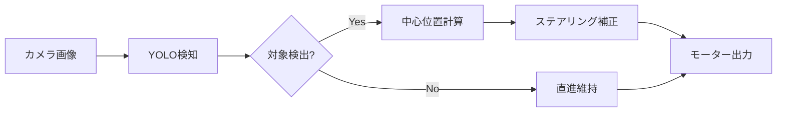

# YOLO物体検知

YOLOv11を使った物体検知と自動運転への応用について解説します。

## 概要

YOLO（You Only Look Once）は高速な物体検知モデルです。カメラ画像からリアルタイムで物体を検知し、自動運転の判断に活用できます。

## 基本的な使い方

### モデルの読み込みと推論

```python
from ultralytics import YOLO

# モデルの読み込み
model = YOLO('yolo11n.pt')  # YOLOv11 nano

# 推論実行
results = model(image)

# リアルタイム推論（カメラ）
results = model(source=0, show=True)
```

### Raspberry Pi AI Camera（IMX500）との統合

```python
# IMX500カメラからの入力
from picamera2 import Picamera2

picam2 = Picamera2()
picam2.start()

while True:
    frame = picam2.capture_array()
    results = model(frame)
```

### IMX500形式へのエクスポート

```python
# モデルの読み込み
model = YOLO("yolo11n.pt")

# IMX500形式へエクスポート
model.export(format="imx500")
```

---

## 物体追従制御

検知した物体を追従する制御を実装できます。

### config.py設定

```python
# 物体追従制御を有効化
OBJECT_FOLLOW_ENABLED = True

# 追従対象クラスID（例: route=1, park=4）
FOLLOW_TARGET_CLASS = 1

# ステアリング補正ゲイン（0.5-1.5推奨）
FOLLOW_STEERING_GAIN = 1.0

# 中心不感帯（0.05-0.2推奨、画像幅に対する比率）
FOLLOW_DEADZONE = 0.1
```

### 制御ロジック



---

## 障害物回避制御

検知した障害物を回避する制御です。

### config.py設定

```python
# 障害物回避制御を有効化
OBSTACLE_AVOID_ENABLED = True

# 回避対象クラスID（例: car=0）
AVOID_TARGET_CLASS = 0

# 回避ステアリングゲイン（0.8-1.5推奨）
AVOID_STEERING_GAIN = 1.2

# 回避判定する物体サイズ閾値（画像面積比、0.1-0.25推奨）
AVOID_SIZE_THRESHOLD = 0.15

# 中央エリア幅（画像幅に対する比率、0.3-0.6推奨）
AVOID_CENTER_ZONE = 0.4
```

---

## カスタムモデルの学習

### データセット準備

1. 画像を収集
2. アノテーション（バウンディングボックス）
3. YOLO形式でエクスポート

### 学習実行

```python
from ultralytics import YOLO

# カスタムデータセットで学習
model = YOLO('yolo11n.pt')
model.train(data='custom_dataset.yaml', epochs=100)

# 学習済みモデルを保存
model.save('models/custom_yolo.pt')
```

### カスタムクラス定義

```python
# config.py
YOLO_ENABLED = True

# カスタムクラス定義
YOLO_CLASSES = {
    0: "car",
    1: "route",
    2: "stop_sign",
    3: "traffic_light",
    4: "park"
}

# 物体追従: routeクラスを追従
FOLLOW_TARGET_CLASS = 1

# 障害物回避: carクラスを回避
AVOID_TARGET_CLASS = 0
```

---

## 制御ルールの組み合わせ

信号や標識による制御も可能です。

```python
# 制御ルール: 信号や標識で減速/停止
CONTROL_RULES = {
    "stop_sign": {"action": "stop", "duration": 3.0},
    "traffic_light_red": {"action": "stop"},
    "traffic_light_green": {"action": "go"},
}
```

---

## パフォーマンス

| モデル | Jetson推論速度 | RPi推論速度 | 精度 |
|--------|---------------|------------|------|
| yolo11n | ~10ms | ~100ms | 標準 |
| yolo11s | ~20ms | ~200ms | 高い |

!!! tip "推奨"
    リアルタイム性が必要な場合は`yolo11n`（nano）を使用してください。
