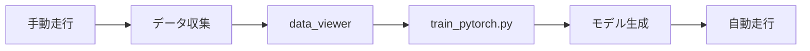

# プログラム全体像

togikidriveの自動運転走行ロジックの全体像を解説します。

---

## プログラム構成図


---

## 主なプログラム構成

| プログラム名 | 役割 | 説明 |
| ------------ | ---- | ---- |
| **run.py** | メインループ | 走行時のループ処理をするメインプログラム |
| **config.py** | 設定 | パラメータ用プログラム（デバイス自動検出機能付き） |
| **ultrasonic.py** | 認知 | 超音波測定用プログラム（RPi4/5/Jetson自動対応） |
| **lidar.py** | 認知 | LiDAR測定用プログラム |
| **planner.py** | 判断 | 走行ロジック用プログラム |
| **motor.py** | 操作 | 操舵・モーター出力/調整用プログラム |
| **train_pytorch.py** | 学習 | 機械学習用プログラム |
| **[data_viewer](https://github.com/Romihi/data_viewer)** | ツール | 走行データ可視化/学習用Webアプリ |

---

## 各プログラムの関係

```
┌─────────────────────────────────────────────────────────────┐
│                        run.py                               │
│                    （メインループ）                          │
├─────────────────────────────────────────────────────────────┤
│                                                             │
│  ┌──────────────┐   ┌──────────────┐   ┌──────────────┐    │
│  │ ultrasonic.py│   │  planner.py  │   │   motor.py   │    │
│  │  lidar.py    │ → │              │ → │              │    │
│  │  camera.py   │   │              │   │              │    │
│  └──────────────┘   └──────────────┘   └──────────────┘    │
│       認知               判断               操作            │
│                                                             │
├─────────────────────────────────────────────────────────────┤
│                       config.py                             │
│                   （全体の設定管理）                         │
└─────────────────────────────────────────────────────────────┘
```

この「認知→判断→操作」のループを繰り返すことで、ミニカーは自動で走行します。

---

## run.py のメインループ

```python
# run.py の簡略化したイメージ

while running:
    # 1. 認知: センサーからデータ取得
    sensor_data = get_sensor_data()      # ultrasonic.py, lidar.py
    camera_image = get_camera_image()    # camera.py

    # 2. 判断: 走行ロジックでステアリング・スロットルを決定
    steering, throttle = planner.plan(sensor_data, camera_image)  # planner.py

    # 3. 操作: モーターに出力
    motor.set_steering(steering)         # motor.py
    motor.set_throttle(throttle)

    # 4. データ記録（学習用）
    if recording:
        save_data(sensor_data, camera_image, steering, throttle)
```

---

## 主な走行ロジック

config.pyの`PLAN`で走行ロジックを切り替えます。

| モード | 判断方式 | 入力 | 説明 |
|--------|---------|------|------|
| `manual` | 手動 | コントローラー | 人間が操作 |
| `go_straight` | ルール | なし | 直進のみ |
| `right_left_3` | ルール | 超音波3点 | 3センサー障害物回避 |
| `wall_follow` | ルール | 超音波 | 壁沿い走行 |
| `wall_follow_pid` | PID制御 | 超音波 | PID壁沿い走行 |
| `nn` | ニューラルネット | 超音波/LiDar | センサー値で学習 |
| `donkeycar` | CNN | カメラ画像 | 画像認識（軽量） |
| `resnet18` | CNN | カメラ画像 | 画像認識 |

---

## データの流れ

### 手動走行時（データ収集）

```
コントローラー入力
       ↓
   steering, throttle
       ↓
   motor.py（モーター出力）
       ↓
   データ保存（画像 + 操作値）
```

### 自動走行時（推論）

```
センサー/カメラ
       ↓
   planner.py（モデル推論）
       ↓
   steering, throttle
       ↓
   motor.py（モーター出力）
```

---

## 学習の流れ



1. **手動走行**: コントローラーで走行しながらデータ収集
2. **データ確認**: data_viewerで収集データを確認・クレンジング
3. **学習**: train_pytorch.pyでモデルを学習
4. **自動走行**: 学習したモデルで自動走行

---

## 関連ツール

| ツール | 説明 | リンク |
|--------|------|--------|
| **data_viewer** | データ可視化・学習WebUI | [GitHub](https://github.com/Romihi/data_viewer) |
| **annotation_training_d2j** | 画像アノテーション・学習 | [GitHub](https://github.com/Romihi/annotation_training_d2j) |

!!! note "CNNモデルの学習"
    画像入力を使ったCNNモデル（donkeycar, resnet18等）の学習には
    [annotation_training_d2j](https://github.com/Romihi/annotation_training_d2j)の統合が必要です。
