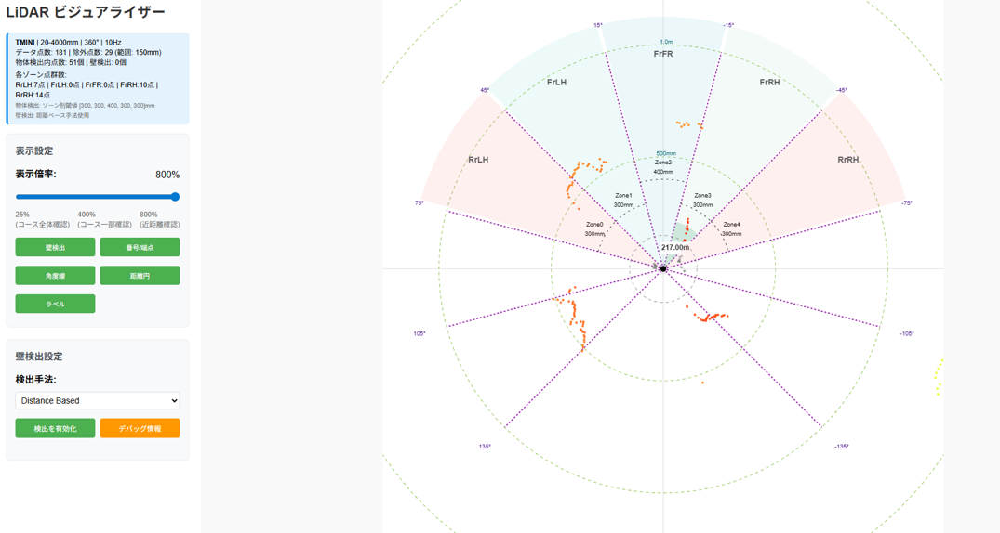
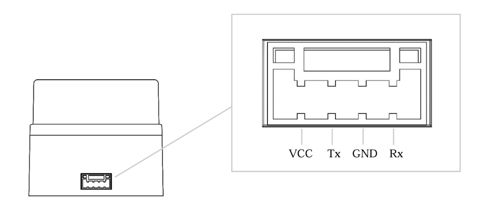

# センサー確認

超音波センサ、LiDAR、カメラなどの動作確認を行います。

---

## 超音波センサ

```bash
python ultrasonic.py
```

## 測定テストの項目

### 基本動作確認
- 各センサーが正しく接続されているか確認
- 測定値が表示されることを確認

### 精度テスト
- 定規で実際の距離を測り、測定値との誤差を確認（±3mm以内が目安）
- 異なる距離（10cm、50cm、100cm、200cm）での測定精度を検証

### 検知範囲テスト
- 最小検知距離（約2cm）の確認
- 最大検知距離（設定値まで）の確認
- 検知角度（約±15度）を手をかざして確認

### 材質による影響
- 硬い平面（壁、板）での測定
- 柔らかい素材（布、スポンジ）での測定
- 角度のある面での反射確認

### 距離計測の原理

超音波センサーは**ToF（Time of Flight）**方式で距離を計測します。

```
トリガー  ──┐  ┌──────────────────────────
            │  │
            └──┘  10μs

エコー    ────────┐              ┌────────
                 │    往復時間   │
                 └──────────────┘

距離 = (往復時間 × 音速) / 2
     = (elapsed_time × 340m/s) / 2
```

---

## LiDAR

LiDARセンサの動作確認を行います。

```bash
python lidar.py
```

ブラウザで `http://localhost:8080` にアクセスすると、LiDARビジュアライザーが表示されます。点群データやゾーン分割がリアルタイムで可視化されるので、センサーの取り付け向きや検出範囲が正しいか確認してください。



### 対応機種

| 機種 | スキャン範囲 | 接続方式 | データ点数 |
|------|-------------|---------|-----------|
| YDLIDAR TMINI | 360度 | シリアル（UART） | 約400点 |
| 北陽 UST-10/20LX等 | 270度 | イーサネット | 約1081点 |

#### YDLIDAR T-mini UART接続

YDLIDAR T-miniをUART接続する場合のピンアサインです。

{ style="max-height: 280px; display: inline-block;" }

**YDLIDAR T-mini 接続表**

| YDLIDAR TMINI | Raspberry Pi/Jetson Orin Nano |
|---------------|------------------------------|
| TX | GPIO15 (RXD) |
| RX | GPIO14 (TXD) |
| VCC | 5V |
| GND | GND |

!!! note "UART設定"
    UART接続にはデバイスごとに事前設定が必要です。[セットアップ手順](../setup.md) の「UART有効化（LiDAR使用時）」を参照してください。

    | デバイス | シリアルポート | config.py設定 |
    |---------|-------------|--------------|
    | Raspberry Pi | `/dev/ttyAMA0` | `LIDAR_SERIAL_PORT = "/dev/ttyAMA0"` |
    | Jetson Orin Nano | `/dev/ttyTHS1` | `LIDAR_SERIAL_PORT = "/dev/ttyTHS1"` |

> 出典: YDLIDAR T-mini Plus Data Sheet, &copy; 2023 EAI
> [https://d1c6gk3tn6ydje.cloudfront.net/2036899223840006144/161db662c9e5a765435dfe03c4cd708e.pdf](https://d1c6gk3tn6ydje.cloudfront.net/2036899223840006144/161db662c9e5a765435dfe03c4cd708e.pdf)

### データ項目（YDLIDAR T-miniの例）

1回のスキャンで得られる点群データは、各点ごとに以下の項目を持ちます。

| データ項目 | 単位 | 説明 |
|-----------|------|------|
| angle（角度） | 度（°） | スキャン角度（0°〜360°） |
| range（距離） | m → mm に変換 | 測定対象までの距離。システム内部ではmmに変換して使用 |
| intensity（反射強度） | - | 反射光の強度。 |

#### 座標変換式

```
x = r × cos(θ)
y = r × sin(θ)
```

#### Python サンプルコード

```python
import ydlidar
import math

# センサーの初期化
laser = ydlidar.CYdLidar()
laser.setlidaropt(ydlidar.LidarPropSerialPort, "/dev/ttyUSB0")
laser.setlidaropt(ydlidar.LidarPropSerialBaudrate, 115200)
laser.initialize()
laser.turnOn()

scan = ydlidar.LaserScan()

while laser.doProcessSimple(scan):
    for point in scan.points:
        r      = point.range      # 距離 [m]
        theta  = point.angle      # 角度 [rad]
        intens = point.intensity  # 反射強度 [0–255]

        # 無効点をスキップ
        if r == 0.0:
            continue

        # 極座標 → 直交座標
        x = r * math.cos(theta)
        y = r * math.sin(theta)

        print(f"θ={math.degrees(theta):.1f}°  r={r:.3f}m  → ({x:.3f}, {y:.3f})")
```

### ゾーン分割

LiDARの点群データは超音波センサーと同じ5つのゾーンに分割して使用できます。

```
             FrFR 前方
               ↑
    左前 FrLH       FrRH 右前
    　　　↖        ↗ 
RrLH 左   ←   [車]  → RrRH 右
```

| ゾーン名 | 説明 |
|---------|------|
| RrLH | 左 |
| FrLH | 左前方 |
| FrFR | 前方 |
| FrRH | 右前方 |
| RrRH | 右 |

### ゾーン判定の計算ロジック

LiDARの点群データ（角度と距離）から、各点がどのゾーンに属するかを判定します。

```python
# config.py でのゾーン角度設定例
ZONE_INDEX = {
    "RrLH": (180, 225),   # 左: 180°〜225°
    "FrLH": (225, 315),   # 左前方: 225°〜315°
    "FrFR": (315, 45),    # 前方: 315°〜45°（0度をまたぐ）
    "FrRH": (45, 135),    # 右前方: 45°〜135°
    "RrRH": (135, 180),   # 右: 135°〜180°
}
```

#### 各ゾーンの最小距離を取得

```python
def get_zone_distances(points: list[tuple[float, float]]) -> dict[str, float]:
    """
    点群から各ゾーンの最小距離を計算

    Args:
        points: [(角度, 距離), ...] のリスト

    Returns:
        dict: {"FrFR": 500.0, "FrLH": 300.0, ...}
    """
    zone_distances = {zone: float('inf') for zone in ZONE_INDEX}

    for angle, distance in points:
        if distance <= 0:
            continue

        for zone_name, (start, end) in ZONE_INDEX.items():
            if is_in_zone(angle, start, end):
                # 同じゾーン内で最も近い距離を採用
                zone_distances[zone_name] = min(zone_distances[zone_name], distance)
                break

    return zone_distances
```

---

## 測定テストの項目

### 基本動作確認

- LiDARが正しく接続されているか確認
- Webビューアで点群が表示されることを確認
- 各ゾーンの距離値が更新されることを確認

### 広範囲スキャン確認

- LiDARは360度または270度をスキャン
- 車両の周囲を歩いて、どの位置で検出されるか確認
- 超音波センサー（約15度×数点）との違いを体感

### 精度テスト

- 定規で実際の距離を測り、LiDAR値と比較
- 超音波センサーとの精度比較（LiDARは数mm〜数cm精度）

### 点群密度の確認

- 1回のスキャンで数百〜千点のデータを取得
- ビューアで点群の密度を確認

---

## 超音波センサーとLiDARの比較

| 項目 | 超音波センサー | LiDAR |
|------|--------------|-------|
| 精度 | ±3mm | 数mm〜数cm |
| 検知範囲 | 約15度（片側） | 270度〜360度 |
| 更新速度 | 〜100Hz | 10〜40Hz |
| コスト | 低い | 高い |
| 複数障害物 | 検知困難 | 同時検知可能 |
| 設定難易度 | 簡単 | やや複雑 |

### センサーデータの正規化

超音波・LiDARの距離値は `normalize_distance()` で0〜1の範囲に正規化して使用します。

```python
def normalize_distance(distance_mm: float, max_range: float = 2000.0) -> float:
    normalized = distance_mm / max_range
    return max(0.0, min(1.0, normalized))
```

| 入力値 | max_range=2000 | 説明 |
|-------|---------------|------|
| 0mm | 0.0 | 最小距離 |
| 500mm | 0.25 | 近距離 |
| 1000mm | 0.5 | 中距離 |
| 2000mm | 1.0 | 最大距離 |

---

## カメラ

カメラの動作確認を行います。

```bash
python camera.py
```

### 対応カメラ

| カメラ | 接続方式 | 解像度 |
|--------|---------|--------|
| USB Webカメラ | USB | 640x480等 |
| Raspberry Pi Camera | CSI | 640x480等 |

### カメラの用途

カメラは主に以下の用途で使用します：

- **機械学習による走行**: CNNモデルで画像から操舵角を推論
- **物体検知**: YOLOによるコース上の障害物検知
- **データ記録**: 走行データの録画・学習データ収集

---

## 測定テストの項目

- カメラ映像が正しく表示されることを確認
- 明るさや角度を調整
- 録画機能で走行データを記録

---

## monitor.py - リアルタイム監視

`monitor.py`で走行中のミニカーをリアルタイムで監視できます。

```bash
# 単独で監視サーバーを起動
python monitor.py

# run.pyと連携して使用（推奨）
python run.py
```

ブラウザで `http://localhost:8888` にアクセスして確認できます。
