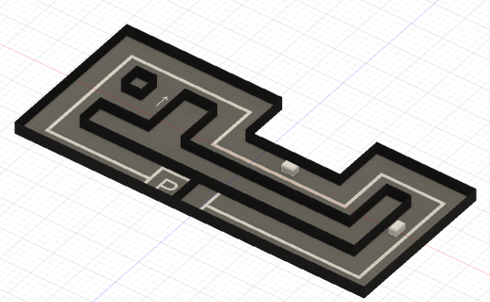

# コース

<video controls autoplay muted loop playsinline style="width:100%; max-width:480px;">
  <source src="../assets/movies/minicar_run_camove_light.mp4" type="video/mp4">
</video>

タイムアタックで使用するコースの説明です。

---

## シンプルコース

基本的な周回コース。直線とカーブで構成され、自動走行の基礎を確認できます。

### 走行のコツ

| 区間 | 走行のコツ |
|------|----------|
| ストレート | スロットル一定、ステアリング真ん中 |
| コーナー | 進入前に減速、ゆっくりハンドル |

---

## タスクコース

ボーナスタスク付きの応用コース。1周走行とPエリア停止でタイム短縮を狙えます。

### 走行のコツ

| 区間 | 走行のコツ |
|------|----------|
| ストレート | スロットル一定、ステアリング真ん中 |
| 直角コーナー | 進入前に減速、ゆっくりハンドル |
| ジグザグ | 慌てず一つずつ丁寧に |
| U字カーブ | 一定のハンドル角度を保つ |
| Pエリア | 減速して枠内に停止 |

---

## タイムアタックルール

**各チーム3回まで挑戦可能**

### ペナルティ（加算）

| 項目 | ペナルティ |
|------|-----------|
| 壁や障害物に接触 | **+1秒** |
| 手で修正 | **+3秒** |

### ボーナス（減算）

| タスク | ボーナス |
|--------|---------|
| 矢印の向きに1周回る | **-5秒**（2周目以上はなし） |
| Pの枠内で壁にぶつからず停止 | **-3秒** |

### 計測方法

1. スタートラインにミニカーを配置
2. **Sボタン**で自動モードに切替
3. ストップウォッチで計測
4. ゴール通過またはPエリア停止で終了

---

## 記録シート

[記録シートをダウンロード (CSV)](assets/record_sheet.csv){ .md-button }

| チーム | 1回目 | 2回目 | 3回目 | ベスト | ペナルティ | ボーナス | 最終タイム |
|-------|-------|-------|-------|-------|-----------|---------|-----------|
| A | __秒 | __秒 | __秒 | __秒 | +__秒 | -__秒 | __秒 |
| B | __秒 | __秒 | __秒 | __秒 | +__秒 | -__秒 | __秒 |
| C | __秒 | __秒 | __秒 | __秒 | +__秒 | -__秒 | __秒 |

**最終タイム = ベストタイム + ペナルティ - ボーナス**
