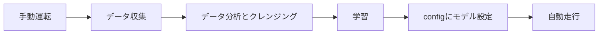

# ニューラルネットワークでルールを学習しよう

ルールベースで制御していた超音波センサーの値を入力とし、コントローラからの操作値を教師データとして模倣学習するニューラルネットワークでの走行を実施します。

## 概要



---

## 利用可能なモデル一覧

用途に応じて複数のモデルから選択できます：

| モデル名 | 入力データ | 特徴 | 学習時間 | 推論速度 | おすすめ度 |
|---------|----------|------|---------|---------|-----------|
| **nn** | センサー値 | 全結合NN、シンプル | 短 | 非常に速い | ★★★☆☆ |
| **donkeycar** | 画像 | 軽量CNN、バランス型 | 中 | 速い | ★★★★★ |
| **resnet18** | 画像 | 高精度、事前学習済み | 長 | 中 | ★★★★☆ |
| **mobilevit_xxs** | 画像 | Vision Transformer | 中 | 中 | ★★★☆☆ |
| **edgenext_xx_small** | 画像 | エッジ最適化 | 中 | 速い | ★★★★☆ |

#### 1epochあたりの学習時間の目安（Orin Nano Super）

| モデル名 | 1epochあたり |
|---------|------------|
| **donkeycar** | 数秒 |
| **resnet18** | 約50秒 |
| **mobilevit_xxs** | 約70秒 |
| **edgenext_xx_small** | 約120秒 |

※ donkeycar以外の画像モデルは事前学習済みの重みを使用するため、3〜5epochで十分な精度が得られます。

### モデル詳細

#### nn（ニューラルネットワーク）

超音波センサー/LiDARの距離データから操作を学習。画像を使わないシンプルなモデル。

```
センサー入力(5値) → 全結合層×3 → 出力(steering, throttle)
```

- ✅ 非常に軽量
- ✅ 学習が高速でRaspberry Piでも学習可能
- ✅ カメラ不要
- ⚠️ 画像モデルより精度は劣る

#### donkeycar（軽量CNN）- おすすめ

DonkeyCarプロジェクトの軽量畳み込みニューラルネットワーク。

```
入力画像(224x224x3) → Conv2D×5 → 全結合層x2 → 出力(steering, throttle)
```

- ✅ 軽量で高速
- ✅ 学習時間が短い
- ✅ Raspberry Piでも動作可能
- ✅ 初心者に最適

#### resnet18（ResNet18）

ImageNetで事前学習済みのモデルを転移学習。

- ✅ 高精度（複雑なコースに強い）
- ✅ 少ないデータでも学習可能
- ⚠️ 学習時間が長い
- ⚠️ モデルサイズが大きい

#### mobilevit_xxs / edgenext_xx_small

最新のエッジAI向けアーキテクチャ。ONNX経由のTensorRT変換で高速化。

- ✅ コース変化や外乱に強い
- ✅ TensorRT変換で3.9〜5.15倍高速化（`python tools/torch2trt_converter.py`）
- ⚠️ PyTorchのままだと遅い

---

### PyTorchモデル定義

各モデルのPyTorchによる実装例です。

#### nn（全結合ニューラルネットワーク）

センサー値を入力とするシンプルな全結合ネットワーク。

```python
import torch
import torch.nn as nn

class SensorNN(nn.Module):
    """
    超音波センサー/LiDAR値を入力とする全結合ニューラルネットワーク

    入力: センサー値（5次元: RrLH, FrLH, FrFR, FrRH, RrRH）
    出力: steering, throttle（2次元）
    """

    def __init__(self, input_dim=5, hidden_dim=64, num_hidden_layers=3, output_dim=2):
        super(SensorNN, self).__init__()

        layers = []

        # 入力層 → 最初の隠れ層
        layers.append(nn.Linear(input_dim, hidden_dim))
        layers.append(nn.ReLU())
        layers.append(nn.Dropout(0.2))

        # 隠れ層
        for _ in range(num_hidden_layers - 1):
            layers.append(nn.Linear(hidden_dim, hidden_dim))
            layers.append(nn.ReLU())
            layers.append(nn.Dropout(0.2))

        # 出力層
        layers.append(nn.Linear(hidden_dim, output_dim))
        layers.append(nn.Tanh())  # 出力を-1〜1に制限

        self.network = nn.Sequential(*layers)

    def forward(self, x):
        """
        Args:
            x: センサー値 (batch_size, 5)
               正規化済み（0〜1の範囲）

        Returns:
            出力 (batch_size, 2): [steering, throttle]
        """
        return self.network(x)


# 使用例
model = SensorNN(input_dim=5, hidden_dim=64, num_hidden_layers=3)
sensor_data = torch.tensor([[0.25, 0.15, 0.5, 0.3, 0.4]])  # 正規化済みセンサー値
output = model(sensor_data)
steering, throttle = output[0]
```

#### donkeycar（軽量CNN）

DonkeyCarプロジェクトの軽量畳み込みニューラルネットワーク。

```python
import torch
import torch.nn as nn

class DonkeyCarCNN(nn.Module):
    """
    DonkeyCarスタイルの軽量CNN

    入力: 画像（3, 224, 224）
    出力: steering, throttle（2次元）
    """

    def __init__(self):
        super(DonkeyCarCNN, self).__init__()

        # 畳み込み層
        self.conv_layers = nn.Sequential(
            # Conv1: 3 -> 24, kernel=5, stride=2
            nn.Conv2d(3, 24, kernel_size=5, stride=2),
            nn.ReLU(),

            # Conv2: 24 -> 32, kernel=5, stride=2
            nn.Conv2d(24, 32, kernel_size=5, stride=2),
            nn.ReLU(),

            # Conv3: 32 -> 64, kernel=5, stride=2
            nn.Conv2d(32, 64, kernel_size=5, stride=2),
            nn.ReLU(),

            # Conv4: 64 -> 64, kernel=3, stride=2
            nn.Conv2d(64, 64, kernel_size=3, stride=2),
            nn.ReLU(),

            # Conv5: 64 -> 64, kernel=3, stride=1
            nn.Conv2d(64, 64, kernel_size=3, stride=1),
            nn.ReLU(),
        )

        # 全結合層
        self.fc_layers = nn.Sequential(
            nn.Flatten(),
            nn.Linear(64 * 10 * 10, 100),
            nn.ReLU(),
            nn.Dropout(0.5),
            nn.Linear(100, 50),
            nn.ReLU(),
            nn.Dropout(0.5),
            nn.Linear(50, 2),
            nn.Tanh(),
        )

    def forward(self, x):
        """
        Args:
            x: 入力画像 (batch_size, 3, 224, 224)
               正規化済み（0〜1の範囲）

        Returns:
            出力 (batch_size, 2): [steering, throttle]
        """
        x = self.conv_layers(x)
        x = self.fc_layers(x)
        return x


# 使用例
model = DonkeyCarCNN()
image = torch.randn(1, 3, 224, 224)  # ダミー画像
output = model(image)
steering, throttle = output[0]
```

#### resnet18（転移学習）

ImageNetで事前学習済みのResNet18を転移学習。

```python
import torch
import torch.nn as nn
from torchvision import models

class ResNet18Pilot(nn.Module):
    """
    ResNet18ベースの転移学習モデル

    入力: 画像（3, 224, 224）
    出力: steering, throttle（2次元）
    """

    def __init__(self, pretrained=True):
        super(ResNet18Pilot, self).__init__()

        # 事前学習済みResNet18をロード
        self.backbone = models.resnet18(
            weights=models.ResNet18_Weights.IMAGENET1K_V1 if pretrained else None
        )

        # 最終層の入力次元を取得
        num_features = self.backbone.fc.in_features

        # 最終層を置き換え
        self.backbone.fc = nn.Sequential(
            nn.Linear(num_features, 256),
            nn.ReLU(),
            nn.Dropout(0.5),
            nn.Linear(256, 64),
            nn.ReLU(),
            nn.Dropout(0.3),
            nn.Linear(64, 2),
            nn.Tanh(),
        )

    def forward(self, x):
        """
        Args:
            x: 入力画像 (batch_size, 3, 224, 224)
               ImageNet正規化済み

        Returns:
            出力 (batch_size, 2): [steering, throttle]
        """
        return self.backbone(x)

    def freeze_backbone(self, freeze=True):
        """
        バックボーンの重みを固定/解除

        Args:
            freeze: Trueで固定、Falseで解除
        """
        for name, param in self.backbone.named_parameters():
            if 'fc' not in name:
                param.requires_grad = not freeze


# 使用例
model = ResNet18Pilot(pretrained=True)

# 最初はバックボーンを固定して学習（転移学習）
model.freeze_backbone(freeze=True)

# 画像の前処理（ImageNet正規化）
from torchvision import transforms
preprocess = transforms.Compose([
    transforms.Resize((224, 224)),
    transforms.ToTensor(),
    transforms.Normalize(
        mean=[0.485, 0.456, 0.406],
        std=[0.229, 0.224, 0.225]
    ),
])

# 推論
image = torch.randn(1, 3, 224, 224)  # ダミー画像（正規化済み）
output = model(image)
steering, throttle = output[0]
```

#### モデルの学習ループ例

```python
import torch
import torch.nn as nn
import torch.optim as optim
from torch.utils.data import DataLoader

def train_model(model, train_loader, val_loader, epochs=30, lr=0.001):
    """
    モデルの学習

    Args:
        model: PyTorchモデル
        train_loader: 学習データローダー
        val_loader: 検証データローダー
        epochs: エポック数
        lr: 学習率
    """
    device = torch.device("cuda" if torch.cuda.is_available() else "cpu")
    model = model.to(device)

    criterion = nn.MSELoss()
    optimizer = optim.Adam(model.parameters(), lr=lr)
    scheduler = optim.lr_scheduler.ReduceLROnPlateau(
        optimizer, mode='min', factor=0.5, patience=5
    )

    best_val_loss = float('inf')

    for epoch in range(epochs):
        # 学習フェーズ
        model.train()
        train_loss = 0.0
        for inputs, targets in train_loader:
            inputs, targets = inputs.to(device), targets.to(device)

            optimizer.zero_grad()
            outputs = model(inputs)
            loss = criterion(outputs, targets)
            loss.backward()
            optimizer.step()

            train_loss += loss.item()

        train_loss /= len(train_loader)

        # 検証フェーズ
        model.eval()
        val_loss = 0.0
        with torch.no_grad():
            for inputs, targets in val_loader:
                inputs, targets = inputs.to(device), targets.to(device)
                outputs = model(inputs)
                loss = criterion(outputs, targets)
                val_loss += loss.item()

        val_loss /= len(val_loader)
        scheduler.step(val_loss)

        print(f"Epoch {epoch+1}/{epochs} - Train Loss: {train_loss:.4f}, Val Loss: {val_loss:.4f}")

        # ベストモデルを保存
        if val_loss < best_val_loss:
            best_val_loss = val_loss
            torch.save(model.state_dict(), "best_model.pth")

    return model
```

---

### モデル選択ガイド

| 状況 | おすすめモデル |
|-----|--------------|
| **センサーのみで試したい** | nn |
| **初心者・ハンズオン** | donkeycar |
| **高精度を目指す** | resnet18, edgenext_xx_small |
| **Jetson + TensorRT** | edgenext_xx_small |

### 推論速度の比較（Jetson Orin Nano + TensorRT）

| モデル | 推論時間 | FPS | 速度向上 |
|-------|---------|-----|---------|
| donkeycar | 1.65ms | 606 | 1.26x |
| edgenext_xx_small | 4.42ms | 226 | 5.15x |
| resnet18 | 4.89ms | 204 | 2.12x |
| mobilevit_xxs | 7.43ms | 134 | 3.92x |

---

## 機械学習関連のconfig.py設定

```python
# モデルのパス
# 推論エンジンは拡張子から自動判定: .pth→PyTorch, .engine→TensorRT, .xml→OpenVINO
MODEL_DIR = "models"
MODEL_NAME = "donkeycar_20260310.pth"       # PyTorchで推論
# MODEL_NAME = "donkeycar_20260310.engine"  # TensorRTで推論（Jetson高速化）

## モデルと学習のハイパーパラメータ設定
HIDDEN_DIM = 64           # 隠れ層のノード数
NUM_HIDDEN_LAYERS = 3     # 隠れ層の数
BATCH_SIZE = 8

# 超音波センサー正規化
NORMALIZE_RANGE = 2000  # 2000mm → 1.0
```

---

## 学習手順

### ステップ1: データ収集

マニュアルモードで走行し、操作データを記録：

```bash
python run.py
```

- Yボタン（または設定したキー）で記録開始/停止
- できるだけ多くのパターンを収集

### ステップ2: 学習実行

```bash
# config.pyの設定に基づいて自動的に学習を実行
python train_pytorch.py
```

または、[data_viewer](https://github.com/Romihi/data_viewer)（nnモデル利用時の推奨）を利用し、収集したデータの分析や学習に使用しないデータ（クラッシュ時、手で修正した時など）を除外できます。


**インストール:**

```bash
# リポジトリをクローン
git clone https://github.com/Romihi/data_viewer.git
cd data_viewer

# 依存パッケージをインストール
pip install -r requirements.txt
```

**起動方法:**

```bash
python app.py
# または
./run.sh
```

ブラウザで `http://localhost:5000` にアクセス

**主な機能:**

| 機能 | 説明 |
|------|------|
| **データ可視化** | Chart.jsによるインタラクティブなタイムラインチャート |
| **ヒストグラム** | ステアリング・スロットルのデータ分布をリアルタイム表示 |
| **統計パネル** | 平均、標準偏差、最小/最大値、四分位数を自動計算 |
| **画像確認** | 複数カメラ画像の同時表示、スライダーで任意フレームを確認 |
| **データ処理** | 正規化（-1〜1）、移動平均（MA）、指数移動平均（EMA）による平滑化 |
| **削除管理** | 不良データの範囲選択と削除インデックス管理 |
| **学習機能** | ニューラルネットワークの学習を実行 |


### ステップ3: モデル設定

```python
# config.py
PLAN = "nn"
## 学習済みモデルのパス
model_dir = "models"
model_name = "model_20240709_record_20240624_023159.csv_epoch_30_uls_RrLH_FrLH_Fr_FrRH_RrRH.pth"
model_path = os.path.join(model_dir, model_name)
```

### ステップ3.5: TensorRT変換（Jetsonのみ・任意）

Jetsonで画像モデルを使用する場合、TensorRT変換で推論速度を大幅に向上できます。
学習完了後に自動で提案されますが、後から手動で実行することもできます:

```bash
python tools/torch2trt_converter.py
```

変換後は config.py の `MODEL_NAME` を `.engine` ファイルに変更するだけで使用できます（推論エンジンは拡張子から自動判定されます）:

```python
# config.py
MODEL_NAME = "edgenext_xx_small_20260208.engine"  # .pth → .engine に変更するだけ
```

詳細は [TensorRT / OpenVINO 推論](../reference/inference.md) を参照してください。

### ステップ4: 学習したモデルで自動走行

```bash
python run.py
```

---

## カメラデータのアノテーションと学習

カメラを使った画像認識モデルの学習には、以下の手順を推奨します：

### 1. データ収集

```python
# config.py
SAVE_FORMAT = "donkeycar"  # Donkeycarフォーマットで保存
```

### 2. データ分析・学習ツール

#### annotation_training_d2j

[annotation_training_d2j](https://github.com/Romihi/annotation_training_d2j)は、より高度なデータ処理を行うツールです：

- データアノテーション（ラベル付け）
- データ拡張（回転、明度変更など）
- 位置推論モデルの学習

---

## 実習課題

### 課題1: 超音波センサーNNの学習

1. マニュアルモードで周回コースを10周走行
2. 収集したデータで学習
3. `nn`モードで自動走行を試す
4. 結果を評価

### 課題2: 異なるハイパーパラメータの比較

| 設定 | hidden_dim | num_hidden_layers | 結果 |
|-----|------------|-------------------|------|
| A | 32 | 2 | |
| B | 64 | 3 | |
| C | 128 | 4 | |

### 課題3: データ量と精度の関係

1. 5周分のデータで学習
2. 10周分のデータで学習
3. 20周分のデータで学習
4. それぞれの走行精度を比較

---

## トラブルシューティング

### GPUメモリ不足（Jetson Orin Nano等）

Jetsonデバイスは **CPUとGPUがメモリを共有** しています（Orin Nano: 合計7.6GB）。
以下のエラーが出る場合はメモリ不足です:

```
NvMapMemAllocInternalTagged: 1075072515 error 12
NvMapMemHandleAlloc: error 0
RuntimeError: NVML_SUCCESS == r INTERNAL ASSERT FAILED
```

**原因:** VS Code Remote SSH 接続時、VS Code Server の Node.js プロセスが **約2〜3GB** のメモリを消費します。

**対処法:**

```bash
# 1. VS Code の Remote SSH 接続を切断してから実行
#    （VS Code のウィンドウを閉じるか、リモート接続を切断）

# 2. VS Code Server プロセスを停止（約2-3GB解放）
pkill -f vscode-server

# 3. GUIデスクトップを停止（任意、約100MB解放）
sudo systemctl stop gdm

# 4. SSHターミナルから直接学習を実行
python train_pytorch.py
```

**メモリ使用状況の確認:**

```bash
# リアルタイムでメモリ・GPU使用率を確認
sudo tegrastats

# メモリ消費の多いプロセスを確認
ps aux --sort=-%mem | head -10
```

### モデルが学習しない

- データ量が少なすぎる可能性
- 学習率が適切か確認
- データにノイズが多い場合はフィルタリング

### 推論時に異常動作

- 学習データと推論時の環境が異なる可能性
- センサーのキャリブレーションを確認
- モデルが過学習している可能性
