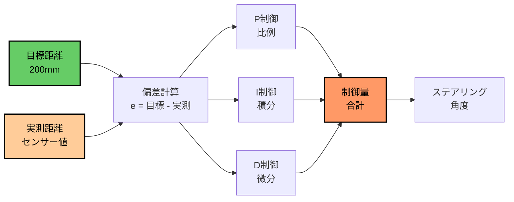

# PID制御で舵角値をいい感じにしよう

PID制御を使って壁沿い走行を滑らかにする方法を学びます。

## PID制御とは

PID制御は、目標値と現在値の差（偏差）を使って制御量を決定する手法です。壁沿い走行では、目標距離と実測距離の差からステアリング角度を計算します。



## 各制御の役割

| 制御 | 計算式 | 役割 | 効果 |
|------|--------|------|------|
| **P（比例）** | `K_P × 偏差` | 現在の偏差に比例した制御 | 基本的な追従性能 |
| **I（積分）** | `K_I × Σ偏差` | 過去の偏差の累積を考慮 | 定常偏差の除去 |
| **D（微分）** | `K_D × Δ偏差` | 偏差の変化率を考慮 | 振動の抑制、応答性向上 |

## config.py設定

```python
PLAN = "wall_follow_pid"

# 右手法/左手法の選択
HAND_SIDE = "right"  # "left"

## PIDパラメータ(PDまでを推奨)
K_P = 0.005  # 比例ゲイン
K_I = 0.0    # 積分ゲイン（通常0で十分）
K_D = 0.0005 # 微分ゲイン

# 目標距離の設定
TARGET_RANGE = 200  # 壁からの目標距離(mm)
```

---

## パラメータ調整のコツ

### ステップ1: まずP制御のみで調整

```python
K_P = 0.005
K_I = 0.0
K_D = 0.0
```

- K_Pを徐々に上げて基本的な追従を確認
- 振動し始める手前で止める

### ステップ2: 次にD制御を追加

```python
K_P = 0.005
K_I = 0.0
K_D = 0.0005
```

- K_Dを少しずつ上げて振動を抑制
- 応答が遅くならない程度に調整

### ステップ3: 必要に応じてI制御を追加

```python
K_P = 0.005
K_I = 0.0001  # 非常に小さい値から
K_D = 0.0005
```

- 定常的なズレがある場合のみ使用
- K_Iは非常に小さい値から開始

---

## 調整時の現象と対策

| 現象 | 原因 | 対策 |
|------|------|------|
| 振動する | K_Pが大きすぎる | K_Pを下げる、K_Dを上げる |
| 追従が遅い | K_Pが小さすぎる | K_Pを上げる |
| オーバーシュート | K_Dが小さすぎる | K_Dを上げる |
| 定常偏差がある | I制御が不足 | K_Iを少し追加 |
| 発振する | K_Iが大きすぎる | K_Iを下げる |

---

## 実習：パラメータチューニング

### 目標
壁から200mmの距離を維持しながら走行する

### 記録シート

| 試行 | K_P | K_I | K_D | 結果 |
|-----|-----|-----|-----|------|
| 1 | 0.003 | 0 | 0 | |
| 2 | 0.005 | 0 | 0 | |
| 3 | 0.007 | 0 | 0 | |
| 4 | 0.005 | 0 | 0.0003 | |
| 5 | 0.005 | 0 | 0.0005 | |

### 評価基準

- **安定性**: 振動せずに走行できるか
- **追従性**: 壁との距離を維持できるか
- **応答性**: 壁が近づいた時に素早く反応するか

---

## 発展課題

### 課題1: 異なる目標距離での調整

- `TARGET_RANGE = 150` に変更
- 同じパラメータで動作するか確認
- 必要に応じて再調整

### 課題2: 速度を変えた場合の調整

- `FORWARD_S`を変更（0.4 → 0.6）
- PIDパラメータの再調整が必要か検証

### 課題3: 左手法と右手法の切り替え

- `HAND_SIDE = "left"` に変更
- 同じパラメータで動作するか確認
