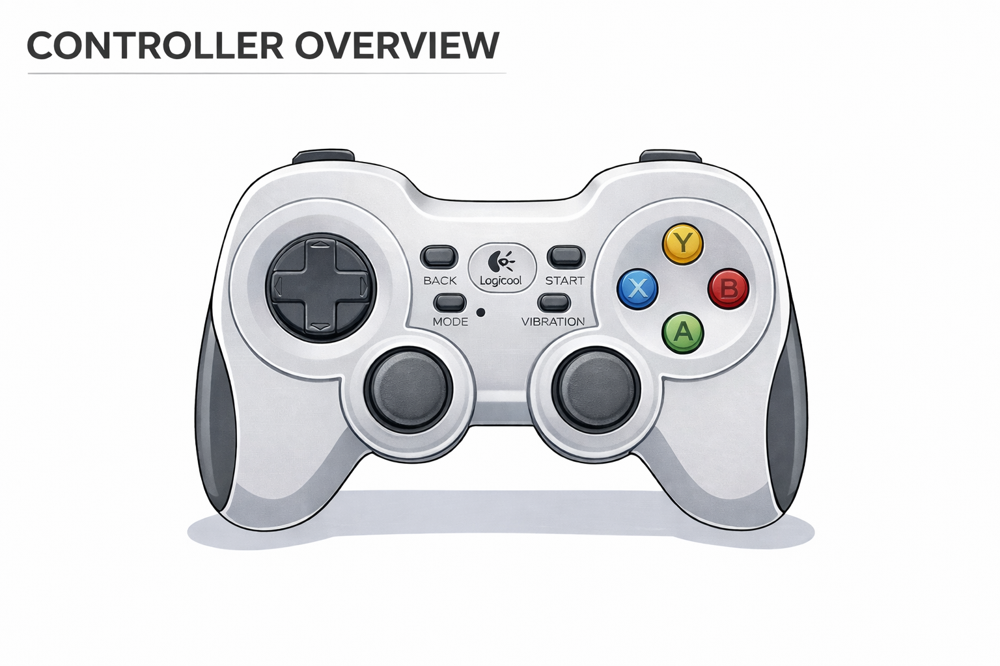

# ハンズオン ガイド

自動運転ミニカー講習の進行ガイドです。このページを見ながら進めてください。

---

## タイムスケジュール（3時間）

| 時間 | 内容 | 所要時間 |
|-----|------|---------|
| 00:00-00:20 | [0. 全体像・環境確認](#0) | 20分 |
| 00:20-00:40 | [1. センサー確認](#1) | 20分 |
| 00:40-01:00 | [2. モーター調整](#2) | 20分 |
| 01:00-01:10 | **休憩** | 10分 |
| 01:10-01:30 | [3. データ収集](#3) | 20分 |
| 01:30-01:40 | [4. データ分析](#4-data_viewer) | 10分 |
| 01:40-02:10 | [5. 学習](#5) | 30分 |
| 02:10-02:30 | [6. 練習タイム](#6) | 20分 |
| 02:30-03:00 | [7. タイムアタック](#7) | 30分 |

---

## 0. 全体像

### 自動運転の3ステップ

```
認知（センサー）→ 判断（プランナー）→ 操作（モーター）
```

プログラムの詳細な構成は **[プログラム全体像](basics/program-overview.md)** を参照してください。

---

## 1. センサー確認

### 超音波センサー

```bash
python ultrasonic.py
```

- 定規で実際の距離を測り、センサー値と比較
- 検知角度（約±15度）を手をかざして確認

### LiDAR（使用する場合）

```bash
python lidar.py
```

ブラウザで `http://localhost:8080` にアクセス

### カメラ・センサー統合確認

```bash
python monitor.py
```

ブラウザで `http://localhost:8888` にアクセス

!!! info "詳細"
    詳しくは **[センサー確認](basics/sensors.md)** を参照してください。

---

## 2. モーター調整

### 実行

```bash
python motor.py
```

### 調整手順

1. **ステアリング**: 真ん中→左最大舵角→右最大舵角の値を探す
2. **スロットル**: ニュートラル（ピッピッピ音）→前進最大出力→後進最大出力の値を探す


### config.py に保存

```python
# ステアリング
STEERING_CENTER_PWM = 420    # 真ん中の値
STEERING_WIDTH_PWM = 80      # 左右の振れ幅

# スロットル
THROTTLE_STOPPED_PWM = 390   # ニュートラル
THROTTLE_FORWARD_PWM = 450   # 前進
THROTTLE_REVERSE_PWM = 330   # 後進
```

!!! warning "注意"
    極端なステアリング値によりサーボモータが破損する恐れがあります
    最大舵角を入力した際に、サーボモータからジ-っという音が鳴らないようにしてください

!!! info "詳細"
    詳しくは **[モーター確認](basics/motor.md)** を参照してください。

---

## 3. データ収集

### config.py 設定

```python
PLAN = "manual"
SAVE_FORMAT = "donkeycar"
ACTIVE_SENSORS = ["lidar", "camera_0"]  # または ["ultrasonic", "camera_0"]
```

### 実行

```bash
python run.py
```

### コントローラー操作


Logicool F710などを利用

<div style="display: grid; grid-template-columns: auto 1fr; gap: 1.5em; font-size: 0.82em; margin: 1em 0;">
<div>
<b>スティック</b><br>
左（左右）：ステアリング<br>
右（上下）：スロットル
<br><br>
<b>設定</b><br>
MODEボタン：光っていない状態<br>
背面スイッチ：X<br>
Sボタン：モード切替
</div>
<div style="text-align: center;">
<b>ボタン</b>
<div style="display: grid; grid-template-columns: 1fr 1fr 1fr; gap: 2px; max-width: 280px; margin: 0.3em auto;">
<div></div><div style="border: 1px solid #ccc; padding: 0.3em 0.5em; border-radius: 4px;"><b>Y</b> 記録</div><div></div>
<div style="border: 1px solid #ccc; padding: 0.3em 0.5em; border-radius: 4px;"><b>X</b> 速度1</div><div></div><div style="border: 1px solid #ccc; padding: 0.3em 0.5em; border-radius: 4px;"><b>B</b> 速度2</div>
<div></div><div style="border: 1px solid #ccc; padding: 0.3em 0.5em; border-radius: 4px;"><b>A</b> ブレーキ</div><div></div>
</div>
</div>
</div>

### 記録手順

1. **Yボタン** → 記録開始
2. コースを走行（最低3周、滑らかに操作）
3. **Yボタン** → 記録停止

!!! tip "記録のコツ"
    - 急なハンドル操作は避ける
    - 様々な場所を走る
    - 1000フレーム以上推奨

!!! info "詳細"
    コントローラーについては **[コントローラー](basics/controllers.md)** 、パラメータ設定については **[パラメータ設定](basics/config.md)** を参照してください。

---

## 4. データ分析（data_viewer）

### インストール（初回のみ）

```bash
git clone https://github.com/Romihi/data_viewer.git
cd data_viewer
pip install -r requirements.txt
```

### 起動

```bash
python app.py
```

ブラウザで `http://localhost:5000` にアクセス

### 主な機能

| 機能 | 説明 |
|------|------|
| タイムライン | ステアリング・スロットルの時系列表示 |
| ヒストグラム | データ分布の確認 |
| 画像確認 | スライダーで任意フレームを確認 |
| 削除管理 | 不良データの範囲を除外 |
| 学習 | ニューラルネットワークの学習実行 |

### 確認ポイント

- データ量は十分か（2000フレーム以上）
- 操作が滑らかか（ギザギザしていないか）
- 左右のバランスは取れているか

!!! info "詳細"
    data_viewerについては **[関連プロジェクト](projects.md)** を参照してください。

---

## 5. 学習

### config.py 設定

```python
PLAN = "donkeycar"  
EPOCHS = 30
BATCH_SIZE = 64
MODEL_INPUT_IMAGE = "cam1/image_array"
```

### モデル選択

| モデル | 特徴 | おすすめ度 |
|--------|------|-----------|
| nn | センサー値のみ、高速 | ★★★☆☆ |
| **donkeycar** | 軽量CNN、バランス型 | ★★★★★ |
| resnet18 | 高精度、学習時間長い | ★★★★☆ |

### 実行（data_viewerを使用）

data_viewerの学習機能を使用するか、コマンドラインで実行：

```bash
python train_pytorch.py
```

### 学習の評価

```
良い例: Train Loss: 0.008, Val Loss: 0.009（両方下がる）
悪い例: Train Loss: 0.003, Val Loss: 0.040（Val Lossが上がる＝過学習）
```

!!! info "詳細"
    詳しくは **[機械学習](exercises/machine-learning.md)** を参照してください。

---

## 6. 自動走行

### config.py 設定

```python
PLAN = "donkeycar"
MODEL_NAME = "donkeycar_YYYYMMDD_HHMMSS.pth"  # 学習で生成されたファイル名
```

### 実行

```bash
python run.py
```

### モード切替（Sボタン）

```
user（手動）→ auto_str（ステアリング自動）→ auto（完全自動）→ user → ...
```

| モード | ステアリング | スロットル |
|-------|------------|----------|
| user | 手動 | 手動 |
| auto_str | 自動 | 手動 |
| auto | 自動 | 自動 |

### 動作確認手順

1. **user**モードで手動走行テスト
2. ミニカーをスタート位置に配置
3. **Sボタン**で**auto**モードに切替
4. 走行開始
5. 停止は**Aボタン**または**Sボタン**でuserに戻す

### トラブルシューティング

| 現象 | 対策 |
|-----|------|
| 動かない | MODEL_PATHを確認 |
| ハンドルを切らない | データを追加して再学習、学習のepochを進める |
| 壁にぶつかる・ふらふらする | データクレンジングを行い、データの精度を高めて再学習 |

!!! info "詳細"
    パラメータ設定については **[パラメータ設定](basics/config.md)** を参照してください。

---

## 7. タイムアタック

**[シンプルコース](course.md#シンプルコース)** を使用します。

コースの詳細、ルール、記録シートは **[コース](course.md)** ページを参照してください。

---

## クイックリファレンス

### よく使うコマンド

```bash
python motor.py        # モーター調整
python ultrasonic.py   # 超音波センサー確認
python lidar.py        # LiDAR確認
python monitor.py      # 統合モニター
python run.py          # 走行（手動/自動）
python train_pytorch.py # 学習
```

### コントローラーボタン早見表

| ボタン | 機能 |
|-------|------|
| **Y** | 記録開始/停止 |
| **S** | モード切替（user→auto_str→auto） |
| **X** | 一定速度1（直線用） |
| **B** | 一定速度2（カーブ用） |
| **A** | ブレーキ |

### 改善サイクル

```
データ収集 → 分析 → データクレンジング → 学習 → 自動走行 → 評価 → （繰り返し）
```

それでは、ご自身のペースで開発を開始してください！