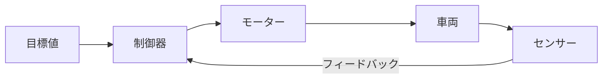

# 操作

自動運転の3番目のステップ「操作」について学びます。

## 操作とは

操作とは、判断結果を実際の動きに変えることです。人間で言えば「手足を動かす」に相当します。


---

## 制御値からPWMへの変換

判断モジュールが出力する値（-1.0〜1.0）を、モーターが理解できるPWM信号に変換します。

### ステアリング

```
-1.0 (左最大) ←──── 0.0 (中央) ────→ +1.0 (右最大)
     │                  │                  │
     ▼                  ▼                  ▼
 LEFT_PWM         CENTER_PWM         RIGHT_PWM
  (290)              (370)              (450)
```

### スロットル

```
-1.0 (後退) ←──── 0.0 (停止) ────→ +1.0 (前進)
     │                │                  │
     ▼                ▼                  ▼
REVERSE_PWM     STOPPED_PWM      FORWARD_PWM
   (300)           (370)            (500)
```

---

## ステアリング値と車両の動き

判断セクションで出力したステアリング値（-1〜1）が、実際にどのように車両を動かすかを理解しましょう。

### 変換の全体像

```
ステアリング値 → PWM値 → サーボ角度 → 舵角 → 旋回半径
  (-1〜1)      (340〜500)  (機械的)   (度)    (mm)
   判断の出力    ↑──────── 操作で変換 ────────↑
```

### 各段階の変換

| 段階 | 変換内容 | 例 |
|------|----------|-----|
| ステアリング値 → PWM | 線形変換 | 0.5 → 460 |
| PWM → サーボ角度 | サーボ特性による | 460 → 機械角20° |
| サーボ角度 → 舵角 | リンク機構による | 機械角20° → 舵角15° |
| 舵角 → 旋回半径 | 車両モデルで計算 | 舵角15° → R≒500mm |

### 舵角と旋回半径の関係（アッカーマン・ジオメトリ）

車両が旋回するとき、前輪の舵角と旋回半径には幾何学的な関係があります。

```
                    旋回半径 R
    ←─────────────────────────────→
                                  │
    ┌─────────┐                   │
    │ ∠δ     │ 前輪（舵角δ）     │
    │  ╲      │                   │
    │   ╲     │                   ○ 旋回中心
    │    ╲    │                   │
    │     L   │ ホイールベース    │
    │      ╲  │                   │
    │       ╲ │                   │
    ├─────────┤ 後輪              │
    └─────────┘                   │
```

**旋回半径の計算式**:

```
R = L / tan(δ)

R: 旋回半径（後輪中心から旋回中心までの距離）
L: ホイールベース（前輪軸と後輪軸の距離）
δ: 舵角（前輪の向きと車両の向きの角度差）
```

!!! info "tan関数とは"
    tan（タンジェント）は三角関数の一つで、直角三角形の「対辺÷隣辺」を表します。

    ```
    tan(δ) = 対辺 / 隣辺

    例：tan(15°) ≒ 0.268
        tan(30°) ≒ 0.577
        tan(45°) = 1.000
    ```

    高校数学で学ぶ内容ですが、計算は関数電卓やプログラムで行うので暗記不要です。

**計算例（ミニカーの場合）**:

| 舵角 | ホイールベース | 旋回半径 |
|------|---------------|---------|
| 5° | 150mm | 約1720mm |
| 10° | 150mm | 約850mm |
| 15° | 150mm | 約560mm |
| 20° | 150mm | 約410mm |
| 30° | 150mm | 約260mm |

!!! tip "舵角が大きいほど旋回半径は小さい"
    tan関数の性質により、舵角を2倍にしても旋回半径は半分にはなりません。
    小さな舵角での変化が大きく、大きな舵角での変化は小さくなります。

### 速度と旋回の関係

**低速走行時**:
- 旋回半径はほぼ幾何学的な計算通り
- タイヤはグリップを保つ

**高速走行時**:
- タイヤに**スリップ角**が発生
- 計算より大きな旋回半径になる（アンダーステア）
- 急なハンドル操作はスピンの原因に

```
低速時:                    高速時:
  ↑ 進行方向                 ↗ 実際の進行方向
  │                         ╱
  ┌──┐ タイヤの向き        ┌──┐ タイヤの向き
  └──┘                     └──┘
                              ↑ スリップ角
```

### なぜ正規化（-1〜1）を使うのか

| 理由 | 説明 |
|------|------|
| **車両差の吸収** | 車両ごとにPWM範囲が異なっても、同じ値で制御可能 |
| **モデル統一** | 機械学習モデルの出力と統一した形式 |
| **分離設計** | 判断（ソフトウェア）と操作（ハードウェア）を分離 |
| **直感的** | -1=左最大、0=直進、+1=右最大 と分かりやすい |

---

## PWM信号とは

PWM（Pulse Width Modulation）は、パルス幅で情報を伝える信号方式です。

```
    ┌──┐    ┌──┐    ┌──┐
    │  │    │  │    │  │
────┘  └────┘  └────┘  └────  短いパルス = 小さい値

    ┌────┐  ┌────┐  ┌────┐
    │    │  │    │  │    │
────┘    └──┘    └──┘    └──  長いパルス = 大きい値
```

サーボやESCはこのパルス幅を読み取って、角度や回転速度を制御します。

### サーボ用PWM信号の仕様

| 項目 | 値 | 説明 |
|------|-----|------|
| 周波数 | 50Hz | 1秒間に50回パルスを送信 |
| 周期 | 20ms | パルス間隔（1÷50Hz） |
| パルス幅 | 1〜2ms | この範囲で角度を指定 |

```
←────────── 20ms（周期）──────────→
┌──┐
│  │ 1ms = 左最大
└──┴────────────────────────────────

┌────┐
│    │ 1.5ms = 中央
└────┴──────────────────────────────

┌──────┐
│      │ 2ms = 右最大
└──────┴────────────────────────────
```

!!! note "PWM値とパルス幅の関係"
    config.pyで設定するPWM値（例：370）は、PCA9685の内部カウンタ値です。
    PCA9685は周期を4096分割しており、値370は約1.8msのパルス幅に相当します。

---

## ハードウェア構成

```
Raspberry Pi / Jetson
        │
        │ I2C通信
        ▼
    PCA9685（PWMコントローラ）
        │
        ├── CH0 → ステアリングサーボ
        └── CH1 → ESC（スロットル）
                    │
                    ▼
                 モーター
```

### I2C通信とは

I2C（アイ・スクエアド・シー）は、2本の線だけで複数の機器と通信できる方式です。

| 信号線 | 役割 |
|-------|------|
| SDA | データの送受信 |
| SCL | タイミング同期用クロック |

```
Raspberry Pi ──┬── SDA ──┬── PCA9685（アドレス0x40）
               │         │
               └── SCL ──┘
```

!!! tip "I2Cのメリット"
    - 配線が少ない（2本のみ）
    - 複数の機器を同じ線に接続可能（アドレスで区別）
    - Raspberry PiやJetsonに標準搭載

### PCA9685の役割

PCA9685は16チャンネルのPWM信号を生成できるICです。

| 項目 | 仕様 |
|------|------|
| チャンネル数 | 16ch |
| 分解能 | 12ビット（4096段階） |
| PWM周波数 | 設定可能（サーボ用は50Hz） |
| I2Cアドレス | 0x40（デフォルト） |

Raspberry Pi単体でもPWMは出力できますが、PCA9685を使うことで：

- CPUの負荷を軽減
- 安定したPWM信号を生成
- 複数のサーボ/モーターを制御可能

---

## フィードバック制御

より高度な制御では、結果を見て調整する「フィードバック制御」を使います。



例：PID制御による壁沿い走行
- 目標：壁から200mmの距離を維持
- フィードバック：実際の距離を測定
- 調整：差分に応じてステアリングを修正

---

## 自動走行の実行

学習したモデルで自動走行を実行する手順です。

### 1. モデルの設定

`config.py`で学習済みモデルを指定：

```python
# 判断モード
PLAN = "donkeycar"  # または "nn", "resnet18" など

# 学習済みモデルファイル
MODEL_NAME = "donkeycar_20251205_150000.pth"
MODEL_PATH = os.path.join(MODEL_DIR, MODEL_NAME)

# 使用する画像（画像モデルの場合）
MODEL_INPUT_IMAGE = "cam1/image_array"
```

### 2. プログラムの起動

```bash
python run.py
```

### 3. 走行モードの切り替え

| モード | 説明 | 操作 |
|-------|------|------|
| **user** | 手動操作（すべて人間が操作） | 起動時のデフォルト |
| **auto_str** | 自動ステアリング（スロットルは手動） | Sボタンで切り替え |
| **auto** | 完全自動（ステアリング・スロットル両方自動） | Sボタンで切り替え |

**Sボタン**を押すたびに：`user → auto_str → auto → user → ...` と切り替わります。

### 4. 動作確認手順

1. **手動モードで確認**: まず手動で動かして問題ないことを確認
2. **ミニカーを配置**: スタート位置に置く
3. **自動モードに切り替え**: **Sボタン**を押す（ターミナルにモード表示）
4. **走行開始**: ミニカーが自動で走り始める
5. **停止**: **Aボタン**でブレーキ、または再度**Sボタン**で手動に戻す

### トラブルシューティング

| 現象 | 原因 | 対策 |
|-----|------|-----|
| 動かない | モデルが読み込めていない | MODEL_PATHを確認 |
| ハンドルを切らない | 学習データが不十分 | データを追加して再学習 |
| 壁にぶつかる | 学習データが不十分 | データを追加して再学習 |
| ふらふらする | 操作が荒かった | 滑らかなデータで再学習 |
| 一方向に偏る | データが偏っている | バランスよくデータ収集 |

---

## 改善サイクル

より良い走行を目指して改善を繰り返します：

```
┌─────────────┐
│ データ収集  │
└──────┬──────┘
       ↓
┌─────────────┐
│ データ分析  │  ← data_viewerで確認
└──────┬──────┘
       ↓
┌─────────────┐
│   学習      │  ← train_pytorch.py
└──────┬──────┘
       ↓
┌─────────────┐
│ 自動走行    │  ← 評価
└──────┬──────┘
       ↓
   問題点の特定
       ↓
   （繰り返し）
```

### 改善のヒント

#### データ収集の改善

- コーナーでの操作を増やす
- 速度を変えて走行する
- 様々な位置から走行を開始する
- 逆回りでも走行してデータを収集

#### 学習パラメータの調整

```python
# エポック数を増やす
EPOCHS = 50

# データ拡張を有効化
USE_DATA_AUGMENTATION = True
```

#### 走行パラメータの調整

```python
# 速度を調整（不安定な場合は下げる）
FORWARD_STRAIGHT = 0.35
FORWARD_CORNER = 0.25
```

---

## 考えてみよう

### 1. PWM信号のパルス幅を変えると何が変わる？

??? hint "ヒント"
    - サーボモーターはパルス幅を「角度の指示」として読み取ります
    - パルス幅が1msのときと2msのときで、サーボはどう動くでしょうか？

??? success "解答例"
    **サーボモーターの角度が変わります。**

    - パルス幅1ms → 左最大（約-90°）
    - パルス幅1.5ms → 中央（0°）
    - パルス幅2ms → 右最大（約+90°）

    ESC（スロットル）の場合は、パルス幅に応じてモーターの回転速度が変わります。

### 2. フィードバック制御がない場合、どんな問題が起きる？

??? hint "ヒント"
    - 路面の凹凸やタイヤの摩耗など、実際の走行には予測できない要素があります
    - フィードバックなしで目標の距離を維持できるでしょうか？

??? success "解答例"
    **外乱に対応できず、目標から徐々にずれていきます。**

    例えば壁沿い走行の場合：

    - 路面の傾きで車両が壁に近づいても、修正されない
    - タイヤのグリップ変化で軌道がずれても、気づかない
    - 最終的に壁に衝突したり、コースアウトする

    フィードバック制御があれば、センサーで実際の状態を測定し、目標との差を修正できます。

### 3. 人間の運転と自動運転の「操作」の違いは？

??? hint "ヒント"
    - 人間は「目で見て→判断して→手足を動かす」を連続的に行います
    - 自動運転では「認知→判断→操作」をどのような単位で繰り返しているでしょうか？

??? success "解答例"
    **主な違いは以下の通りです：**

    | 項目 | 人間の運転 | 自動運転 |
    |------|----------|---------|
    | 制御周期 | 連続的（アナログ） | 離散的（例：20Hz） |
    | 操作の滑らかさ | 自然に滑らか | プログラムで補間が必要 |
    | 疲労 | 長時間で低下 | 一定を維持 |
    | 反応速度 | 約0.2秒 | ミリ秒単位で可能 |
    | 学習 | 経験で向上 | データと学習アルゴリズムで向上 |

### 4. ステアリング値0.5のとき、旋回半径はどのくらいになる？

??? hint "ヒント"
    - ステアリング値0.5は「右に50%」の操作です
    - 変換の全体像（ステアリング値→PWM→サーボ角度→舵角→旋回半径）を順番に追ってみましょう

??? success "解答例"
    **概算で約1100mm程度です（車両特性により異なる）。**

    変換の流れ：

    1. ステアリング値0.5 → PWM値約410（線形変換）
    2. PWM値410 → サーボ角度約10°（サーボ特性による）
    3. サーボ角度10° → 舵角約7.5°（リンク機構による、仮定）
    4. 舵角7.5° → 旋回半径 = 150mm / tan(7.5°) ≒ 1140mm

    ※実際の値は車両のリンク機構やサーボ特性によって異なります。

### 5. なぜPCA9685のようなPWMコントローラを使うのか？

??? hint "ヒント"
    - Raspberry PiのCPUは他にも多くの処理を行っています
    - PWM信号は正確なタイミングで出力し続ける必要があります

??? success "解答例"
    **CPU負荷の軽減と信号の安定性のためです。**

    - **CPU負荷軽減**: Raspberry PiのCPUはカメラ画像処理、センサー読み取り、ニューラルネットワーク推論など多くの処理を行っています。PWM信号生成を専用ICに任せることで、CPUの処理能力を他のタスクに使えます。

    - **信号の安定性**: PWM信号は20ms周期で正確に出力する必要があります。CPUが忙しいときにタイミングがずれると、サーボが震えたり、意図しない動きをすることがあります。PCA9685は専用のハードウェアタイマーで安定した信号を生成します。

    - **拡張性**: 16チャンネルあるので、将来的にLEDや追加のサーボを制御することも可能です。
