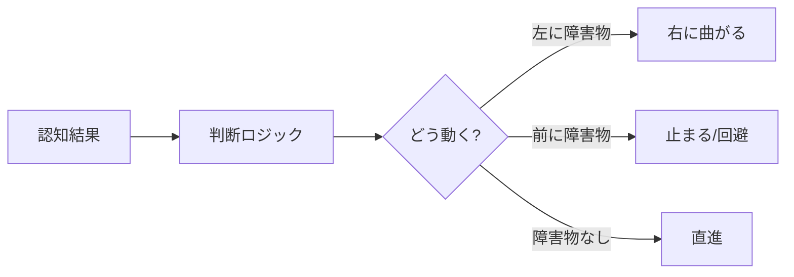
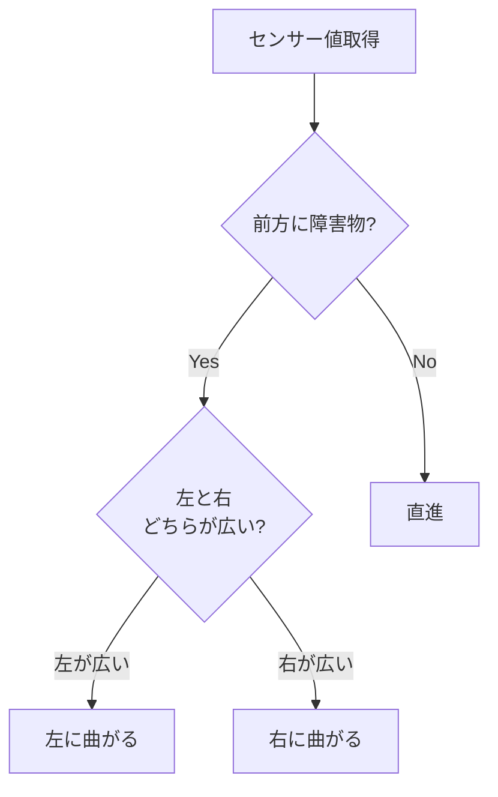
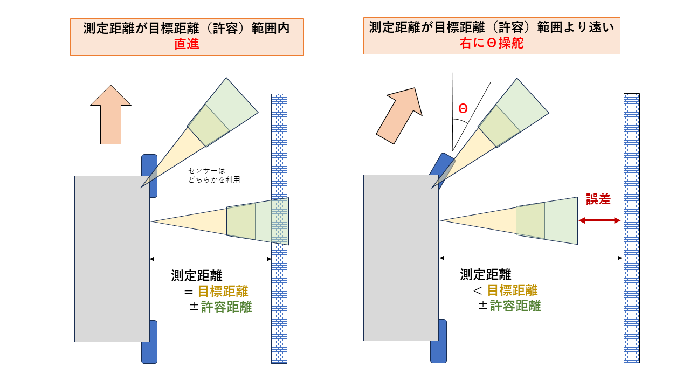
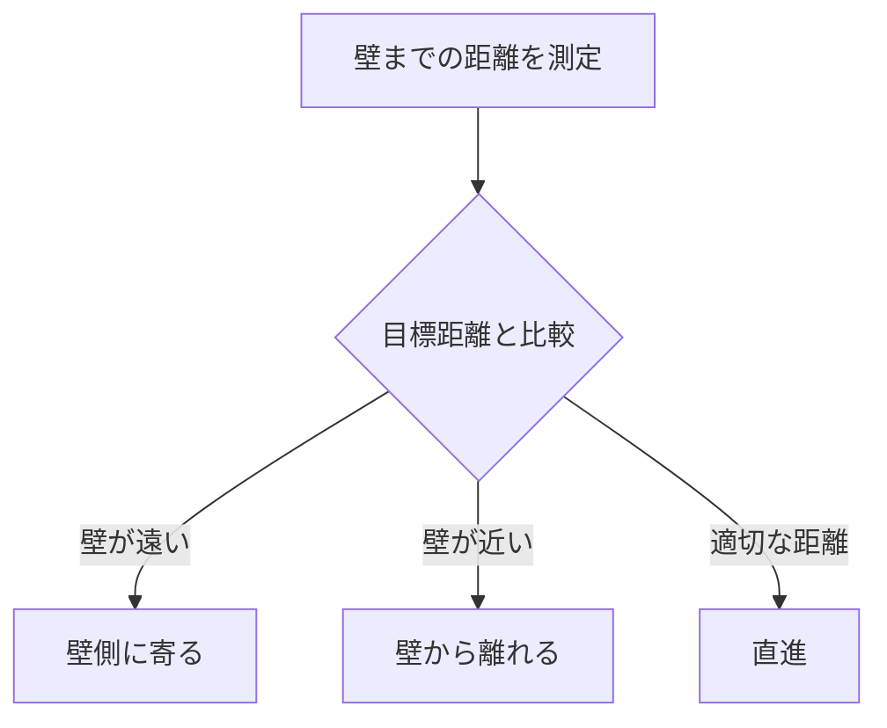
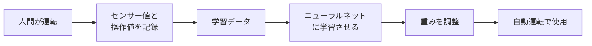

# 判断

自動運転の2番目のステップ「判断」について学びます。

## 判断とは

判断とは、認知で得た情報をもとに「どう動くか」を決めることです。人間で言えば「考える」に相当します。



!!! example "身近な例"
    - **信号機**: 赤なら止まる、青なら進む
    - **ゲームAI**: 敵が近づいたら攻撃、遠ければ追跡
    - **エアコン**: 室温が高ければ冷房、低ければ暖房

---

## 判断方式の比較

判断方法には大きく2つのアプローチがあります。

### ルールベース（プログラム）

人間が「こういう時はこうする」というルールを明示的に書く方法です。

```python
# 例：障害物回避の基本ルール
if 前方に障害物:
    if 左が広い:
        左に曲がる
    else:
        右に曲がる
else:
    直進
```

| メリット | デメリット |
|---------|-----------|
| 動作が明確で予測可能 | 複雑な状況への対応が難しい |
| デバッグしやすい | ルールの数が爆発的に増える |
| 少ないデータで動作 | 人間が全パターンを考える必要 |

### ニューラルネットワーク（機械学習）

人間の運転データを学習して、AIが判断する方法です。

```
入力（センサー値/画像） → ニューラルネット → 出力（操作値）
                         ↑
                   学習データから自動で獲得
```

| メリット | デメリット |
|---------|-----------|
| 複雑なパターンを学習できる | 大量の学習データが必要 |
| 人間が気づかないパターンも発見 | 判断理由が分かりにくい |
| 状況に柔軟に対応 | 学習データにない状況に弱い |

!!! info "どちらを選ぶ？"
    - **シンプルな環境**: ルールベースで十分
    - **複雑な環境**: ニューラルネットワークが有効
    - **実際の自動運転車**: 両方を組み合わせて使用

---

## ルールベースの判断モード

### right_left_3（障害物回避）

前方3つのセンサー（左前・正面・右前）を使って、障害物を回避します。

```
     FrLH    FrFR    FrRH
       ＼     │     ／
         ＼   │   ／
           ＼ │ ／
            [車]
```

#### アルゴリズム



#### コード（簡略版）

```python
def right_left_3(dis_FrLH, dis_FrFR, dis_FrRH):
    # 前方または左右に障害物を検知
    if dis_FrFR < 検知距離 or dis_FrLH < 検知距離 or dis_FrRH < 検知距離:
        # 左右どちらが広いかで判断
        if dis_FrLH < dis_FrRH:
            return 右旋回  # 左が狭いので右へ
        else:
            return 左旋回  # 右が狭いので左へ
    else:
        return 直進  # 障害物なし
```

!!! tip "パラメータ調整"
    - `DETECTION_RANGE`: 前方の検知開始距離（デフォルト: 300mm）
    - `RIGHT_LEFT_RANGE`: 左右の検知開始距離（デフォルト: 550mm）

---

### wall_follow（壁沿い走行）

壁との距離を一定に保ちながら走行します。「右手法」「左手法」を選択できます。



- **右手法**: 右側の壁に沿って走行（FrRH・RrRHセンサーを使用）
- **左手法**: 左側の壁に沿って走行（FrLH・RrLHセンサーを使用）
- **目標距離**: 壁との距離を一定（例: 200mm）に保つ

#### アルゴリズム



#### コード（簡略版）

```python
def wall_follow(dis_front, dis_rear, side="right"):
    target = 目標距離  # 例: 200mm
    adjustment = 許容範囲  # 例: ±25mm

    if 壁が遠い (> target + adjustment):
        壁側に旋回
    elif 壁が近い (< target - adjustment):
        壁から離れる方向に旋回
    else:
        直進
```

!!! warning "注意点"
    壁沿い走行は、壁が途切れたり急に曲がったりすると対応が難しくなります。

---

### wall_follow_pid（PID制御）

より滑らかな壁沿い走行を実現するため、**PID制御** を使用します。

#### PID制御とは

```
制御量 = P（比例） + I（積分） + D（微分）
```

| 項 | 役割 | 効果 |
|---|------|------|
| **P（比例）** | 現在の誤差に比例 | 誤差が大きいほど強く修正 |
| **I（積分）** | 過去の誤差の累積 | 小さな誤差も時間をかけて修正 |
| **D（微分）** | 誤差の変化速度 | 急な変化を抑制、オーバーシュート防止 |

#### 動作イメージ

```
目標距離からのズレ（誤差）
     ↓
  ┌──────────────────────────────────┐
  │  誤差 × Kp  →  比例項（今の誤差）  │
  │  Σ誤差 × Ki →  積分項（累積誤差）  │
  │  Δ誤差 × Kd →  微分項（変化速度）  │
  └──────────────────────────────────┘
     ↓
  ステアリング補正量
```

#### 誤差・操舵・ステアリング値の関係

誤差の計算と、それに応じた操舵の方向を理解することが重要です。

```
誤差 = 現在の壁までの距離 − 目標距離
```

**右手法の場合**（右側に壁）:

| 誤差 | 状況 | 操舵 | ステアリング値 |
|------|------|------|---------------|
| **正（+）** | 壁が遠い | 右に曲がる | 正（+）→ 壁に近づく |
| **0** | 目標距離 | 直進 | 0 |
| **負（−）** | 壁が近い | 左に曲がる | 負（−）→ 壁から離れる |

```
例：目標距離 200mm、現在 250mm の場合
  誤差 = 250 - 200 = +50mm（壁が遠い）
  → ステアリングを正（右）に → 壁に近づく
```

**左手法の場合**（左側に壁）:

| 誤差 | 状況 | 操舵 | ステアリング値 |
|------|------|------|---------------|
| **正（+）** | 壁が遠い | 左に曲がる | 負（−）→ 壁に近づく |
| **0** | 目標距離 | 直進 | 0 |
| **負（−）** | 壁が近い | 右に曲がる | 正（+）→ 壁から離れる |

!!! tip "符号の反転"
    左手法では、誤差からステアリング値を計算する際に符号を反転させます。
    ```python
    if side == "right":
        steering = steering_gain  # そのまま
    else:  # left
        steering = -steering_gain  # 符号反転
    ```

#### パラメータ調整

| パラメータ | 役割 | 調整の影響 |
|-----------|------|-----------|
| `K_P` | 比例ゲイン | 大きくすると反応が速くなるが、振動しやすい |
| `K_I` | 積分ゲイン | 大きくすると定常偏差が減るが、オーバーシュートしやすい |
| `K_D` | 微分ゲイン | 大きくすると振動が抑えられるが、反応が鈍くなる |

!!! example "PIDチューニングの目安"
    1. まず `K_P` のみで調整（`K_I = 0`, `K_D = 0`）
    2. 振動したら `K_D` を少しずつ増やす
    3. 定常偏差が残るなら `K_I` を少しずつ増やす

---

## ニューラルネットワークの判断モード

### nn（超音波センサー入力）

超音波センサーの距離値を入力として、ステアリングとスロットルを出力します。

```
入力層          隠れ層           出力層
(5ノード)       (64ノード×3)     (2ノード)

 FrFR ─┐
 FrLH ─┼─○─○─○─┬─ ステアリング
 FrRH ─┼─○─○─○─┤
 RrLH ─┼─○─○─○─┴─ スロットル
 RrRH ─┘
```

#### ニューラルネットワークの基本

| 用語 | 意味 |
|------|------|
| **ノード（ニューロン）** | 入力を受け取り、計算して出力する単位 |
| **層（レイヤー）** | ノードの集まり。入力層→隠れ層→出力層 |
| **重み（ウェイト）** | ノード間の接続の強さ。学習で調整される |
| **活性化関数** | ノードの出力を非線形に変換する関数 |

#### 学習の仕組み



---

### donkeycar（カメラ入力CNN）

カメラ画像を入力として、**CNN（畳み込みニューラルネットワーク）** で判断します。

```
入力画像            畳み込み層        全結合層      出力
(224×224×3)        (特徴抽出)       (判断)

┌─────────┐    ┌─────┐    ┌───┐   ┌──────────┐
│  画像   │ → │ Conv│ → │ FC│ → │ステアリング│
│         │    │     │    │   │   │スロットル  │
└─────────┘    └─────┘    └───┘   └──────────┘
```

#### CNNが画像認識に強い理由

| 特徴 | 説明 |
|------|------|
| **局所的な特徴検出** | 小さな領域ごとにエッジや模様を検出 |
| **位置不変性** | 物体が画像のどこにあっても認識可能 |
| **階層的な学習** | 低レベル（エッジ）→高レベル（物体）へ段階的に学習 |

#### 畳み込み処理のイメージ

```
入力画像          フィルター        特徴マップ
┌───────────┐    ┌───┐           ┌─────────┐
│ □ □ ■ □ │    │1 0│           │         │
│ □ ■ ■ □ │  × │0 1│    →     │ エッジ  │
│ □ □ ■ □ │    └───┘           │ を検出  │
└───────────┘                    └─────────┘
```

!!! info "なぜ画像入力が有効？"
    - 白線、道路の形状、障害物の種類など、豊富な情報を含む
    - 人間が運転するときに見ている情報に近い
    - 超音波センサーでは得られない視覚的な手がかりを活用

---

## 判断モード一覧

| モード | 方式 | 入力 | 特徴 |
|--------|------|------|------|
| `right_left_3` | ルール | 超音波×3 | シンプルな障害物回避 |
| `wall_follow` | ルール | 超音波×2 | 壁沿い走行（ON/OFF制御） |
| `wall_follow_pid` | ルール | 超音波×2 | 壁沿い走行（PID制御） |
| `nn` | NN | 超音波×5 | 距離値から学習 |
| `donkeycar` | CNN | カメラ画像 | 画像から学習（推奨） |
| `resnet18` | CNN | カメラ画像 | 高精度モデル |

---

## 入力と出力

### 入力データ（認知から受け取る）

| データ種類 | 形式 | 例 |
|-----------|------|-----|
| 超音波距離 | 整数（mm） | `FrFR: 350, FrLH: 520` |
| LiDAR距離 | 浮動小数点（mm） | `FrFR: 350.5` |
| カメラ画像 | 224×224×3 の配列 | RGB画像 |

### 出力データ（操作へ渡す）

すべての判断モードは、同じ形式で出力します。

| 出力 | 範囲 | 意味 |
|------|------|------|
| **ステアリング** | -1.0 〜 1.0 | -1.0=左最大、0=直進、1.0=右最大 |
| **スロットル** | -1.0 〜 1.0 | -1.0=後退、0=停止、1.0=前進最大 |

```python
# 出力例
steering = 0.3   # やや右に曲がる
throttle = 0.4   # 中速で前進
```

!!! success "統一された出力形式"
    判断モードを切り替えても、出力形式が同じなので、
    操作（モーター制御）側の変更は不要です。

---

## 考えてみよう

以下の問いについて考えてみましょう。

### 1. ルールベースで対応できない状況は？

??? hint "ヒント"
    - ルールは人間が「想定した状況」に対して書く
    - 想定外の状況が起きたらどうなる？

??? success "解答例"
    - **複合的な状況**: 前にも左にも右にも障害物がある
    - **新しい障害物**: ルール作成時に想定していなかった形状や色
    - **微妙な判断**: 左右の距離がほぼ同じでどちらに行くべきか
    - **連続的な変化**: 壁のカーブが徐々に変化する状況

### 2. NNの学習データが偏っていたらどうなる？

??? hint "ヒント"
    - NNは「学習したパターン」をもとに判断する
    - 学習データに含まれないパターンは？

??? success "解答例"
    - **右カーブばかり学習** → 左カーブで曲がれない
    - **明るい環境ばかり学習** → 暗い環境で認識できない
    - **低速データばかり学習** → 高速走行で制御が追いつかない
    - **対策**: データ拡張（反転、明度変更など）で偏りを減らす

### 3. ルールとNNを組み合わせることはできる？

??? hint "ヒント"
    - それぞれの得意・不得意を考えよう
    - 安全性を担保するには？

??? success "解答例"
    - **NNで基本走行 + ルールで安全確保**
      - 例: NNがステアリングを決め、前方障害物が近すぎたらルールで強制停止
    - **状況に応じて切り替え**
      - 例: 通常はNN、迷路のような環境ではwall_follow
    - **NNの出力をルールで補正**
      - 例: NNの急ハンドルを滑らかにする

### 4. PID制御のパラメータ調整で振動が起きたら？

??? hint "ヒント"
    - P, I, D それぞれの役割を思い出そう
    - 振動 = 修正しすぎて反対側に行き過ぎる

??? success "解答例"
    - **Kp が大きすぎる** → 比例ゲインを下げる
    - **Kd が小さすぎる** → 微分ゲインを上げて振動を抑制
    - **Ki が大きすぎる** → 積分項がオーバーシュートを引き起こしている

    **調整手順**:
    1. まず `Ki = 0`, `Kd = 0` にしてPのみで調整
    2. 振動したら `Kd` を少しずつ上げる
    3. 安定したら `Ki` を少しずつ上げる

### 5. ステアリング値（-1〜1）と実際の車両の動きの関係は？

??? hint "ヒント"
    - ステアリング値はソフトウェア上の**抽象的な指示**
    - 実際の車両には「舵角」「旋回半径」「ホイールベース」がある
    - この変換は次の「[操作](control.md)」セクションで詳しく学びます

??? success "解答例"
    **変換の流れ（詳細は操作セクションで）**

    ```
    ステアリング値 → PWM値 → サーボ角度 → 舵角 → 旋回半径
      (判断の出力)              (操作セクションで学ぶ)
    ```

    **なぜ正規化（-1〜1）を使う？**

    - 車両ごとのハードウェアの違いを吸収
    - 機械学習モデルの出力と統一
    - **判断（ソフトウェア）と操作（ハードウェア）の分離**

---

## まとめ

| 方式 | 適した場面 | 難易度 |
|------|-----------|--------|
| ルールベース | シンプルな環境、明確なルールがある場合 | 低 |
| PID制御 | 連続的な値を制御したい場合 | 中 |
| ニューラルネット | 複雑なパターン、人間が運転できる状況 | 高 |

!!! example "判断モードの選び方"
    - **まず試す**: `right_left_3`（シンプルで動作確認しやすい）
    - **壁沿い走行**: `wall_follow_pid`（滑らかな動き）
    - **本格的な自動運転**: `donkeycar`（画像学習）

判断した結果は、次のステップ「[操作](control.md)」でモーターに出力されます。
