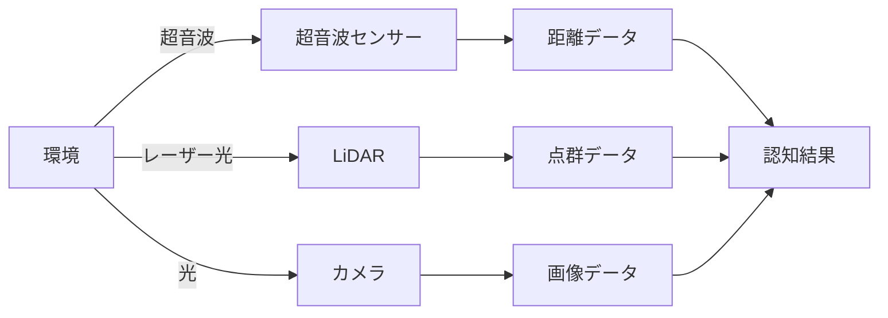
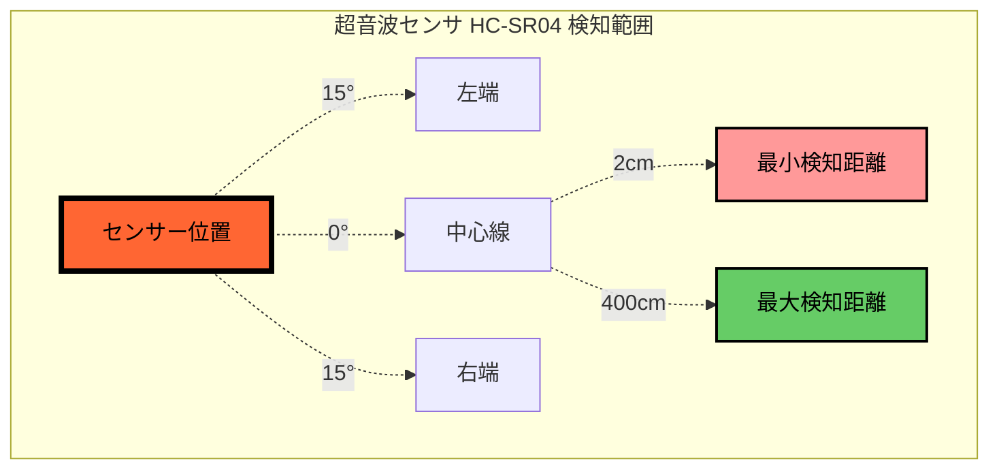
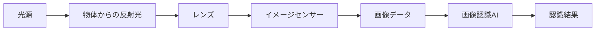

# 認知

自動運転の最初のステップ「認知」について学びます。

## 認知とは

認知とは、センサーを使って周囲の環境を把握することです。人間で言えば「目で見る」「耳で聞く」に相当します。



!!! example "身近な例"
    - **自動ドア**: 人を検知して開閉
    - **駐車センサー**: 障害物までの距離を音で通知
    - **スマホの顔認証**: カメラで顔を認識

---

## 超音波センサによる認知

### 仕組み

超音波センサは **ToF（Time of Flight: 飛行時間）** 方式で距離を測定します。
音波を発射し、物体に反射して戻ってくるまでの時間から距離を計算します。

```
センサー → 超音波発射 → 物体で反射 → センサーで受信
         └────── 往復時間(ToF)を測定 ──────┘
                    ↓
              距離 = ToF × 音速 ÷ 2
```

!!! info "ToF方式とは"
    ToF（Time of Flight）は、信号の「飛行時間」を測定する距離計測の基本原理です。
    超音波センサーでは音波、LiDARではレーザー光を使いますが、どちらも同じToFの考え方で距離を求めます。

### 計算例

!!! example "距離を計算してみよう"
    **条件**: 超音波を発射してから、反射波が戻るまで **0.002秒（2ミリ秒）** かかった

    **音速**: 約 **340 m/s**（気温20℃の場合）

    **計算**:
    ```
    距離 = 0.002秒 × 340 m/s ÷ 2
         = 0.68 m ÷ 2
         = 0.34 m
         = 34 cm
    ```

    ※ 2で割るのは、音波が往復しているため

### 超音波センサの特性

| 項目 | 値 | 補足 |
|------|-----|------|
| 検知角度 | 約15度（片側） | 扇形に広がる |
| 検知距離 | 2cm〜400cm | 近すぎると測定不可 |
| 測定精度 | ±3mm | 温度で変化する |

### 検知範囲



### 超音波センサの弱点

超音波センサは万能ではありません。以下のような状況では正確に測定できないことがあります。

| 状況 | 理由 | 対策 |
|------|------|------|
| **ガラス・鏡** | 音波が斜めに反射して戻らない | カメラと併用 |
| **スポンジ・布** | 音波を吸収してしまう | 複数センサーで確認 |
| **細い棒・ワイヤー** | 反射面が小さすぎる | LiDARを使用 |
| **斜めの壁** | 音波が別方向に反射 | 複数角度から測定 |

!!! warning "温度の影響"
    音速は温度によって変化します（0℃で331m/s、30℃で349m/s）。
    精密な測定には温度補正が必要です。

---

## LiDARによる認知

### 仕組み

LiDAR（Light Detection and Ranging）も超音波センサと同じ **ToF方式** ですが、音波の代わりに **レーザー光** を使用します。

```
センサー → レーザー発射 → 物体で反射 → センサーで受信
         └────── 往復時間(ToF)を測定 ──────┘
                    ↓
              距離 = ToF × 光速 ÷ 2
```

!!! info "超音波との違い"
    - **超音波**: 音速（約340 m/s）を使用 → 測定に時間がかかる
    - **LiDAR**: 光速（約3億 m/s）を使用 → 高速・高精度に測定可能

### 計算例

!!! example "LiDARの距離計算"
    **条件**: レーザーを発射してから、反射光が戻るまで **0.00000001秒（10ナノ秒）** かかった

    **光速**: 約 **3 × 10⁸ m/s**

    **計算**:
    ```
    距離 = 0.00000001秒 × 300,000,000 m/s ÷ 2
         = 3 m ÷ 2
         = 1.5 m
    ```

    ※ 光速が非常に速いため、ナノ秒単位の精密な時間計測が必要

### YDLIDAR T-mini の特性

本講座で使用するLiDARセンサーの仕様です。

| 項目 | 値 | 補足 |
|------|-----|------|
| 検知角度 | 360度 | 全周囲をスキャン |
| 検知距離 | 2cm〜12m | 超音波より広範囲 |
| 測定精度 | ±2cm | 高精度 |
| スキャンレート | 6〜12Hz | 1秒間に6〜12回転 |
| データ点数 | 約400点/回転 | 0.9度間隔 |

### スキャン方式

LiDARはモーターで回転しながらレーザーを照射し、360度全周囲の距離を測定します。

```
          前方 (0°)
            │
     315° ──┼── 45°
           ╱│╲
          ╱ │ ╲
   270° ─┼──●──┼─ 90°
          ╲ │ ╱
           ╲│╱
     225° ──┼── 135°
            │
          後方 (180°)

    ● = LiDARセンサー（回転しながらスキャン）
```

### 超音波センサとの比較

| 項目 | 超音波センサ | LiDAR |
|------|------------|-------|
| 使用波 | 音波（約340 m/s） | レーザー光（光速） |
| 検知範囲 | 約30度（扇形） | 360度（全周囲） |
| 検知距離 | 〜4m | 〜12m |
| データ点数 | 1点/センサー | 約400点/回転 |
| 精度 | ±3mm | ±2cm |
| コスト | 安価（数百円） | 高価（数千〜数万円） |
| 処理負荷 | 低い | 中程度 |

### LiDARの弱点

| 状況 | 理由 | 対策 |
|------|------|------|
| **黒い物体** | レーザー光を吸収する | 反射率の高い材質と組み合わせ |
| **鏡面反射** | 光が別方向に反射 | 複数センサーで補完 |
| **透明な物体** | ガラスを透過する | 超音波センサと併用 |
| **強い日光下** | 外光の影響を受ける | 赤外線フィルター使用 |
| **雨・霧・煙** | 光が散乱する | 他センサーと併用 |

!!! tip "LiDARの用途"
    - **自動運転車**: 周囲の車両・歩行者・障害物を検知
    - **ロボット掃除機**: 部屋の地図を作成（SLAM）
    - **ドローン**: 障害物回避、地形マッピング
    - **測量**: 地形の3Dスキャン

---

## カメラによる認知

### 仕組み

カメラは **光（電磁波）** を捉えて画像データを生成します。人間の目と同じ原理です。



### 画像データの構造

カメラが捉えた画像は、小さな点（ピクセル）の集まりです。

```
┌─────────────────────────────┐
│  224 ピクセル（横）          │
│ ┌───┬───┬───┬─────────────┐ │
│ │R G B│R G B│R G B│  ...    │ │ 224
│ ├───┼───┼───┼─────────────┤ │ ピクセル
│ │R G B│R G B│R G B│  ...    │ │ （縦）
│ └───┴───┴───┴─────────────┘ │
└─────────────────────────────┘
```

| 用語 | 意味 |
|------|------|
| **ピクセル** | 画像を構成する最小の点 |
| **RGB** | 赤(Red)・緑(Green)・青(Blue)の3色 |
| **解像度** | 画像の細かさ（ピクセル数） |

!!! tip "なぜ224×224？"
    機械学習でよく使われるモデル（ResNet、MobileNetなど）の標準入力サイズです。
    大きすぎると処理が遅く、小さすぎると情報が失われます。

### 画像認識でできること

カメラ＋画像認識AIを使うと、超音波センサではできない認識が可能になります。

| 認識内容 | 例 |
|---------|-----|
| **物体検出** | 車、人、標識を見つける |
| **分類** | 信号が赤か青か判断 |
| **セグメンテーション** | 道路と歩道を区別 |
| **線検出** | 白線・黄線を認識 |

### 超音波センサとの比較

| 項目 | 超音波センサ | カメラ |
|------|------------|--------|
| 取得情報 | 距離のみ | 色・形・テクスチャ |
| 処理負荷 | 低い（単純計算） | 高い（AI処理） |
| 環境依存 | 材質に依存 | 照明に依存 |
| 認識対象 | 障害物の有無 | 物体の種類まで |
| コスト | 安価（数百円） | やや高価 |
| 暗所性能 | 問題なし | 性能低下 |

!!! success "センサーフュージョン"
    実際の自動運転車では、複数のセンサーを組み合わせて使います。
    それぞれの弱点を補い合うことで、より安全な認知が可能になります。

---

## データフォーマット

センサーから取得したデータは、学習や分析のために保存されます。

??? note "このセクションについて（クリックで展開）"
    データフォーマットの詳細は、実際にプログラムを書く際に必要になります。
    まずは概要を理解し、必要に応じて参照してください。

### 超音波センサーの距離データ

| 項目 | 値 |
|------|-----|
| 単位 | mm（ミリメートル） |
| 測定範囲 | 20mm〜2000mm |
| データ型 | 整数値（int） |

#### センサー位置と名称

```
        前方
    FrLH  FrFR  FrRH
      ＼   │   ／
        ＼ │ ／
RrLH ───  車  ─── RrRH
        後方
```

| 名称 | 位置 | 用途 |
|------|------|------|
| RrLH | 左後方（Rear Left Hand） | 壁追従（左手法） |
| FrLH | 左前方（Front Left Hand） | 左側障害物検知 |
| FrFR | 前方（Front Front） | 正面障害物検知 |
| FrRH | 右前方（Front Right Hand） | 右側障害物検知 |
| RrRH | 右後方（Rear Right Hand） | 壁追従（右手法） |

#### 保存形式

```json
{
  "ultrasonic/FrFR": 350,
  "ultrasonic/FrLH": 520,
  "ultrasonic/FrRH": 480,
  "ultrasonic/RrLH": 1200,
  "ultrasonic/RrRH": 890
}
```

### LiDARの点群データ

| 項目 | 値 |
|------|-----|
| 単位 | mm（ミリメートル） |
| 測定範囲 | 20mm〜12000mm |
| データ型 | 浮動小数点（float） |
| データ点数 | 約400点/スキャン |

#### データ構造

LiDARは1回のスキャンで約400点の距離データを取得します。各点は角度と距離のペアです。

```
角度 0° → 距離 1250mm
角度 0.9° → 距離 1248mm
角度 1.8° → 距離 1245mm
...
角度 359.1° → 距離 1252mm
```

#### ゾーン分割

超音波センサーと同じ5つのゾーンに分割して、同じインターフェースで使用できます。

```
          前方
    FrLH  FrFR  FrRH
      ＼   │   ／
        ＼ │ ／       各ゾーン約30°
RrLH ───  車  ─── RrRH
        後方
```

#### 保存形式

```json
{
  "lidar/FrFR": 350.5,
  "lidar/FrLH": 520.2,
  "lidar/FrRH": 480.8,
  "lidar/RrLH": 1200.0,
  "lidar/RrRH": 890.3
}
```

!!! tip "LiDAR画像"
    点群データを可視化した画像（224×224）も保存できます。
    白い点が検出した物体の位置を表し、機械学習の入力として使用できます。

### カメラ画像データ

| 項目 | 値 | 補足 |
|------|-----|------|
| 解像度 | 224 × 224 ピクセル | 機械学習の標準サイズ |
| 色深度 | RGB 3チャンネル | 各色0〜255の256段階 |
| フレームレート | 60fps | 1秒間に60枚撮影 |
| ファイル形式 | JPEG | 圧縮画像形式 |

!!! info "fps（frames per second）とは"
    1秒間に何枚の画像を撮影・表示するかを表す単位です。
    60fpsなら1秒間に60枚、つまり約16.7ミリ秒ごとに1枚撮影します。

#### 画像サイズの計算

```
224 × 224 × 3 = 150,528 バイト/フレーム（約150KB）
```

- **224 × 224**: ピクセル数
- **3**: RGBの3チャンネル

#### 保存形式（Donkeycar形式）

```
data/data_20250131_120000/
├── images/
│   ├── 0_cam_image_array_.jpg      # フレーム0
│   ├── 1_cam_image_array_.jpg      # フレーム1
│   └── ...
├── catalog_0.catalog               # メタデータ（0-999）
└── manifest.json                   # 全体設定
```

#### カタログファイルの内容

```json
{
  "_index": 0,
  "cam/image_array": "0_cam_image_array_.jpg",
  "user/angle": 0.15,
  "user/throttle": 0.4,
  "user/mode": "user"
}
```

### データの正規化

学習時には値を0〜1の範囲に正規化します。これにより、異なる単位のデータを同じスケールで扱えます。

| データ | 元の範囲 | 正規化後 | 計算方法 |
|--------|---------|---------|---------|
| 距離 | 0〜2000mm | 0.0〜1.0 | 値 ÷ 2000 |
| ステアリング | -1〜1 | そのまま | - |
| スロットル | -1〜1 | そのまま | - |
| 画像 | 0〜255 | 0.0〜1.0 | 値 ÷ 255 |

!!! info "なぜ正規化が必要？"
    機械学習では、入力値のスケールが揃っていると学習が安定します。
    例えば「距離1000mm」と「ステアリング0.5」を同時に扱う場合、
    正規化しないと距離の影響が大きくなりすぎます。

---

## 考えてみよう

以下の問いについて考えてみましょう。

### 1. 超音波センサで検知できないものは？

??? hint "ヒント"
    - 音波の反射について考えてみよう
    - 「吸収」「透過」「反射角度」がキーワード

??? success "解答例"
    - **ガラス窓**: 音波が透過・斜め反射する
    - **柔らかい布やスポンジ**: 音波を吸収する
    - **細いワイヤー**: 反射面が小さすぎる
    - **毛皮や羽毛**: 音波が散乱する

### 2. カメラだけでは分からない情報は？

??? hint "ヒント"
    - カメラは「光」を捉えるセンサー
    - 「見た目」だけでは判断できないものは？

??? success "解答例"
    - **正確な距離**: 画像だけでは距離の推定が難しい
    - **透明な物体**: ガラスや水は写りにくい
    - **暗闘での状況**: 光がないと何も見えない
    - **物体の材質**: 見た目が同じでも材質は違う可能性

### 3. 複数センサーを組み合わせるメリットは？

??? hint "ヒント"
    - それぞれの「得意」と「苦手」を考えよう
    - 実際の自動運転車はどうしている？

??? success "解答例"
    - **相互補完**: 超音波/LiDARの距離精度 + カメラの物体認識
    - **冗長性**: 一方が故障しても他方でバックアップ
    - **確認**: 複数センサーで検知することで信頼性向上
    - **例**: 前方の障害物を「カメラで車と認識」+「LiDARで距離3mと測定」+「超音波で確認」

### 4. 超音波は斜めの壁が苦手なのに、LiDARはなぜ測れる？

??? hint "ヒント"
    - 光の反射には2種類ある：「鏡のような反射」と「散らばる反射」
    - 壁の表面をミクロの目で見ると、どうなっている？

??? success "解答例"
    **拡散反射（diffuse reflection）** がポイントです。

    **2種類の反射**

    | 反射の種類 | 特徴 | 例 |
    |-----------|------|-----|
    | **鏡面反射** | 入射角＝反射角で一方向に反射 | 鏡、ガラス |
    | **拡散反射** | 全方向に光が散乱 | 壁、道路、木 |

    **なぜ拡散反射が起きるのか**

    現実の壁や物体は、肉眼では滑らかに見えても、ミクロスケールでは無数の凹凸があります。
    レーザー光がこれらの凹凸に当たると、様々な方向に散乱し、一部は必ずセンサーに戻ります。

    ```
         センサー
            ↑ (一部の光が戻る)
            |
        ＼  |  ／
         ＼↓／    ← 拡散反射で全方向に散乱
        ━━━━━━━━  ← 壁（微細な凹凸あり）
           ／＼
    ```

    **超音波との違い**

    - **超音波**: 波長が長い（約8mm）ため、表面の凹凸の影響を受けにくく、鏡面反射に近い挙動
    - **LiDAR**: 波長が短い（約900nm）ため、微細な凹凸で拡散反射が起きやすい

    **注意：斜めでも限界がある**

    極端に浅い角度（grazing angle）では：

    - 反射光量が減少する
    - ビームが楕円形に広がり誤差が生じる
    - 最大測定距離が短くなる

---

## まとめ

| センサー | 取得データ | 得意なこと | 苦手なこと |
|---------|----------|-----------|-----------|
| 超音波 | 距離（1点） | 低コスト、暗所OK | 狭い検知範囲、材質依存 |
| LiDAR | 点群（約400点） | 広範囲・高精度、全周囲 | 高コスト、黒い物体 |
| カメラ | 画像 | 物体認識、色・形の判別 | 距離測定、暗所 |

!!! example "センサーの使い分け"
    - **超音波**: 低コストで手軽に距離測定したい場合
    - **LiDAR**: 広範囲を高精度にスキャンしたい場合
    - **カメラ**: 物体の種類や状態を認識したい場合
    - **組み合わせ**: より安全で信頼性の高いシステムを構築

自動運転では、これらのセンサーを組み合わせて周囲環境を正確に「認知」します。
次のステップ「[判断](decision.md)」では、認知した情報をもとにどう行動するかを学びます。
