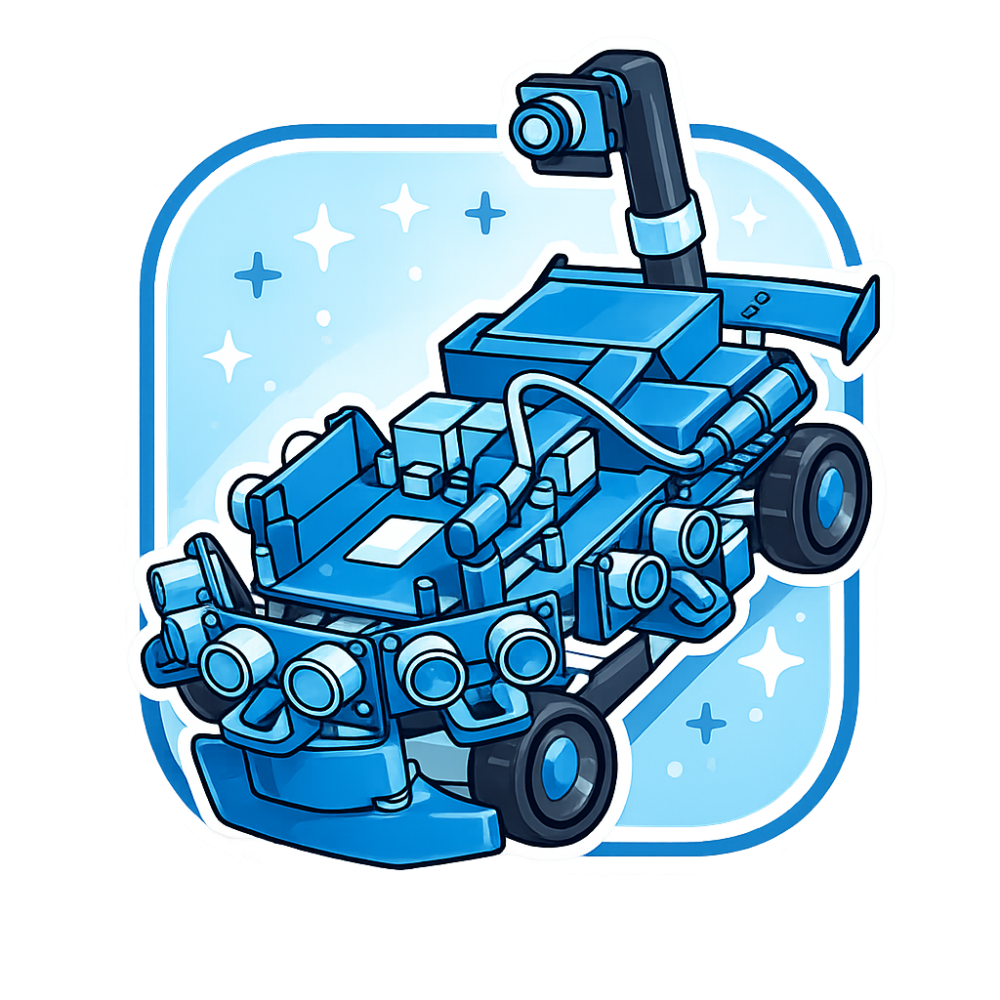

# ミニカー製作

---

## 教育機関の皆様へ

高校・大学などの教育機関を対象に、AIミニカー製作のサポートを行っています。

学生の皆様・教員の皆様と一緒にミニカーの組み立てからプログラミングまでを実施し、学校独自の講座開設や学生研究にご活用いただけるよう支援いたします。

### サポート内容

- ミニカーの製作・組み立て支援
- AI自律走行プログラミングの指導
- 講座カリキュラムの設計・開設サポート
- 学生研究・卒業研究のテーマ相談

ご興味をお持ちの方は、お気軽にお問い合わせください。

**お問い合わせ先**: [aiminicarclub@gmail.com](mailto:aiminicarclub@gmail.com)

