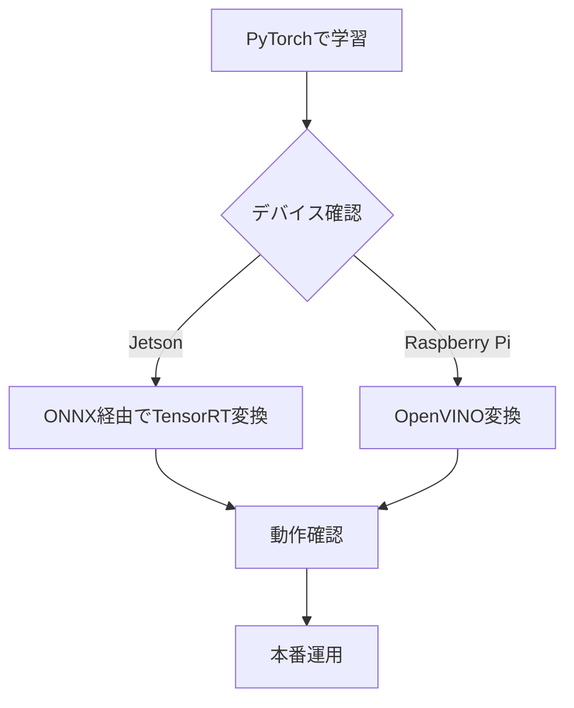

# TensorRT / OpenVINO 推論

学習済みモデルを高速化するための推論エンジンについて解説します。

## 概要

| エンジン | 対象デバイス | 特徴 |
|---------|-------------|------|
| PyTorch | 全デバイス | 開発・デバッグ向け |
| TensorRT | Jetson | NVIDIA GPU最適化 |
| OpenVINO | Raspberry Pi | Intel CPU最適化 |

## config.py設定

```python
# 推論エンジン選択
INFERENCE_ENGINE = "pytorch"  # "tensorrt", "openvino"
```

---

## TensorRT（Jetson向け）

### 変換方式

ONNX経由でtrtexecを使用して変換します（torch2trtは複雑なモデルに非対応のため）。

```
PyTorch (.pth) → ONNX (.onnx) → TensorRT (.trt)
```

### 変換方法

#### 方法1: 学習後の自動提案

`python train_pytorch.py` で学習完了後、Jetsonデバイスが検出されると自動的にTensorRT変換が提案されます。

```
🚀 学習完了！モデル変換オプション
検出されたプラットフォーム: Jetson Orin Nano
💡 Jetsonデバイスが検出されました

TensorRT形式に変換しますか？ (Y/n): y
```

#### 方法2: 変換ツールで手動実行

```bash
python tools/onnx_trt_converter.py
```

対話形式でモデルを選択し変換できます。オプション指定も可能です:

```bash
# 直接指定
python tools/onnx_trt_converter.py --model models/edgenext_xx_small_20260208.pth

# FP32で変換（精度優先）
python tools/onnx_trt_converter.py --fp32

# 中間ONNXファイルを保持
python tools/onnx_trt_converter.py --keep-onnx
```

### 出力ファイル

```
models/
├── edgenext_xx_small_20260208.pth   # 元のPyTorchモデル
└── edgenext_xx_small_20260208.trt   # TensorRTエンジン
```

中間のONNXファイルはデフォルトで自動削除されます。

### ベンチマーク結果（Orin Nano Super / FP16）

| モデル | PyTorch | TensorRT | 高速化率 |
|--------|---------|----------|---------|
| donkeycar | 1.65ms | 1.31ms | 1.26x |
| resnet18 | 10.4ms | 4.89ms | 2.12x |
| mobilevit_xxs | 29.1ms | 7.43ms | 3.92x |
| edgenext_xx_small | 22.8ms | 4.42ms | 5.15x |

### 前提条件

- **trtexec**: `sudo apt install libnvinfer-bin` でインストール
- JetPack SDK に含まれる TensorRT ランタイム

---

## OpenVINO（Raspberry Pi向け）

### インストール

```bash
pip install openvino-dev
```

### 変換手順

```bash
# ONNX経由で変換
python convert_openvino.py --model models/my_model.pth
```

### 変換の流れ

```
PyTorch (.pth) → ONNX (.onnx) → OpenVINO IR (.xml + .bin)
```

### 出力ファイル

```
models/
├── my_model.pth           # 元のPyTorchモデル
├── my_model.xml           # OpenVINOモデル定義
└── my_model.bin           # OpenVINO重み
```

### ベンチマーク結果（参考）

| モデル | PyTorch | OpenVINO | 高速化率 |
|--------|---------|----------|---------|
| donkeycar | 80ms | 25ms | 3.2x |
| resnet18 | 250ms | 70ms | 3.6x |

---

## 使用方法

### TensorRT

```python
# config.py
INFERENCE_ENGINE = "tensorrt"
MODEL_NAME = "edgenext_xx_small_20260208.trt"
```

### OpenVINO

```python
# config.py
INFERENCE_ENGINE = "openvino"
MODEL_NAME = "my_model.xml"
```

---

## トラブルシューティング

### TensorRT: trtexecが見つからない

```
❌ trtexec が見つかりません
```

**対策:**
```bash
sudo apt install libnvinfer-bin
```

### TensorRT: GPUメモリ不足

```
NvMapMemAllocInternalTagged: error 12
```

**対策:**
- 他のGPUプロセス（Jupyter, ブラウザ等）を終了する
- `--fp32` で試す（FP16ビルドはメモリを多く使う場合がある）

### TensorRT: torch2trtでの変換失敗

EdgeNeXt, MobileViT等の複雑なモデルはtorch2trtで変換できません。
`tools/onnx_trt_converter.py` を使用してONNX経由で変換してください。

### OpenVINO変換エラー

```
Error: Unsupported operation
```

**対策:**
- PyTorchのバージョンを確認
- 対応していない演算がないか確認
- ONNX opsetバージョンを調整

### 推論結果が異なる

**確認事項:**
- 入力の正規化が一致しているか
- FP16変換による精度低下
- 前処理・後処理の違い

---

## 推奨フロー



1. まずPyTorchで学習・動作確認
2. デバイスに応じて変換（学習後の自動提案 or 手動ツール）
3. 変換後のモデルで動作確認
4. 精度が許容範囲内か検証
5. 本番運用
