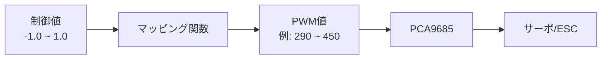

# PWMマッピング詳細

## 概要

制御値（-1.0〜1.0）からPWM信号への変換について詳しく解説します。



## 1. ステアリング（Angle）のマッピング

### 変換式

```python
def steering_to_pwm(steering_value):
    """
    steering_value: -1.0（左最大）〜 1.0（右最大）
    """
    if steering_value >= 0:
        # 右方向（steering_value >= 0）
        pwm = STEERING_CENTER_PWM + (steering_value * STEERING_WIDTH_PWM)
    else:
        # 左方向（steering_value < 0）
        pwm = STEERING_CENTER_PWM + (steering_value * STEERING_WIDTH_PWM)
    return int(pwm)
```

### 数値例

| steering_value | 計算式 | PWM値 |
|---------------|--------|-------|
| -1.0（左最大） | 370 + (-1.0 × 80) | 290 |
| -0.5（左半分） | 370 + (-0.5 × 80) | 330 |
| 0.0（中央） | 370 + (0.0 × 80) | 370 |
| 0.5（右半分） | 370 + (0.5 × 80) | 410 |
| 1.0（右最大） | 370 + (1.0 × 80) | 450 |

### 図解

```
-1.0 (左最大) ←──────── 0.0 (中央) ────────→ +1.0 (右最大)
     │                      │                      │
     ▼                      ▼                      ▼
 LEFT_PWM              CENTER_PWM              RIGHT_PWM
   (290)                  (370)                  (450)
```

---

## 2. スロットル（Throttle）のマッピング

### 変換式

```python
def throttle_to_pwm(throttle_value):
    """
    throttle_value: -1.0（後退最大）〜 1.0（前進最大）
    """
    if throttle_value >= 0:
        # 前進方向（throttle_value >= 0）
        pwm = THROTTLE_STOPPED_PWM + (throttle_value * (THROTTLE_FORWARD_PWM - THROTTLE_STOPPED_PWM))
    else:
        # 後退方向（throttle_value < 0）
        pwm = THROTTLE_STOPPED_PWM + (throttle_value * (THROTTLE_STOPPED_PWM - THROTTLE_REVERSE_PWM))
    return int(pwm)
```

### 数値例

| throttle_value | 計算式 | PWM値 |
|---------------|--------|-------|
| -1.0（後退最大） | 370 + (-1.0 × 70) | 300 |
| 0.0（停止） | 370 | 370 |
| 0.6（前進60%） | 370 + (0.6 × 130) | 448 |
| 1.0（前進最大） | 370 + (1.0 × 130) | 500 |

---

## 3. PWM信号の仕様

| 項目 | 値 |
|------|-----|
| PWM周波数 | 50Hz（20ms周期） |
| パルス幅範囲 | 1.0ms〜2.0ms |
| 中央値 | 1.5ms |
| PCA9685分解能 | 12bit（0〜4095） |

---

## 4. ハードウェアインターフェース

```
Raspberry Pi / Jetson
        │
        │ I2C (SDA, SCL)
        ▼
    PCA9685
    PWMコントローラー
        │
        ├── CH0 → ステアリングサーボ
        └── CH1 → ESC（スロットル）
```

---

## 5. キャリブレーション手順

### ステアリング

1. `python motor.py` を実行
2. 中央位置のPWM値を探す → `STEERING_CENTER_PWM`
3. 左最大のPWM値を探す → 差分を計算
4. 右最大のPWM値を探す → 差分を計算
5. `STEERING_WIDTH_PWM` = (右最大 - 中央) の値を設定

### スロットル

1. `python motor.py` を実行
2. ESCがピッピッピと鳴る(370前後のニュートラル検知ビープ音仕様のもの)PWM値を探す → `THROTTLE_STOPPED_PWM`
3. 前進最大のPWM値を探す → `THROTTLE_FORWARD_PWM`
4. 後退最大のPWM値を探す → `THROTTLE_REVERSE_PWM`

---

## 6. 注意事項

!!! warning "安全注意"
    - 極端なPWM値はサーボやモーターを破損する可能性があります
    - 最初は小さい値から徐々に調整してください
    - ESCのキャリブレーションが必要な場合があります

!!! tip "トラブルシューティング"
    - ステアリングが逆に動く → `STEERING_WIDTH_PWM` の符号を反転
    - スロットルが反応しない → `THROTTLE_STOPPED_PWM` を微調整

---

## 7. 車両ステアリング角度とのマッピング

実際の車両のステアリング角度との対応：

| steering_value | 角度（参考） |
|---------------|-------------|
| -1.0 | 約-30度（左最大） |
| -0.5 | 約-15度 |
| 0.0 | 0度（直進） |
| 0.5 | 約+15度 |
| 1.0 | 約+30度（右最大） |

※角度は車両によって異なります
