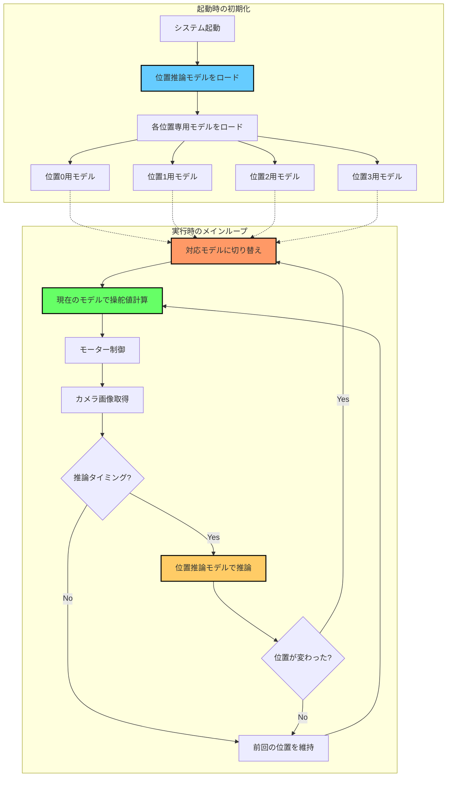

# 位置推論モデルによる自動運転モデル切り替え機能

## 概要

このドキュメントでは、annotation_training_d2jで学習した位置推論モデルを活用して、コース上の位置に応じて最適な自動運転モデルを自動的に切り替える機能について説明します。

## システムアーキテクチャ



## 動作フロー

### 1. 初期化フェーズ

1. **位置推論モデルのロード** (`load_position_model()`)
   - annotation_training_d2jのmodel_catalogから位置推論モデルを取得
   - 学習済み重みを読み込み
   - GPUメモリに配置（利用可能な場合）

2. **位置専用モデル群のロード** (`load_position_specific_models()`)
   - `POSITION_MODELS_MAP`で定義された各位置のモデルをロード
   - 辞書形式（位置ID → モデル）で管理
   - デフォルトモデルの設定（オプション）

### 2. 実行フェーズ

1. **カメラ画像取得**
   - 自動運転モード時のみ動作
   - 推論用カメラ画像を取得

2. **位置推論** (`infer_position()`)
   - `POSITION_INFERENCE_INTERVAL`フレームごとに実行（デフォルト5フレーム）
   - カメラ画像を前処理してモデルに入力
   - Softmax関数で各位置の確率を計算
   - 最大確率の位置IDと信頼度を返す

3. **モデル切り替え**
   - 推論された位置が前回と異なる場合
   - 対応する位置専用モデルに切り替え
   - ログ出力（位置名、信頼度）

4. **自動運転実行**
   - 選択されたモデルで操舵・スロットル値を計算
   - モーター制御に反映

## ファイル構成

### 主要ファイル

```
togikaidrive-dev/
├── config.py                    # 設定ファイル（位置推論設定を含む）
├── run.py                       # メインプログラム（位置推論ロジック実装）
├── annotation_training_d2j/     # annotation_training_d2jサブモジュール
│   ├── model_catalog.py        # 位置推論モデルの定義
│   ├── model_info.py           # モデル情報管理
│   └── model_training.py       # 学習スクリプト
└── models/                      # モデルファイル保存先
    ├── resnet18_location.pth   # 位置推論モデル
    ├── straight_model.pth      # 位置0（直線）用モデル
    ├── left_curve_model.pth    # 位置1（左カーブ）用モデル
    └── ...
```

### コード実装箇所

| ファイル | 行数 | 内容 |
|---------|------|------|
| run.py | 72-83 | 位置推論モジュールのインポート |
| run.py | 156-196 | `load_position_model()` - 位置推論モデルローダー |
| run.py | 199-257 | `load_position_specific_models()` - 位置専用モデル群ローダー |
| run.py | 260-299 | `infer_position()` - 位置推論関数 |
| run.py | 141-152 | システム初期化での位置推論モデルロード |
| run.py | 705-736 | メインループでの位置推論とモデル切り替え |
| run.py | 743-753 | 切り替えられたモデルでの推論実行 |
| run.py | 800-804 | 位置情報のターミナル出力 |
| config.py | 64-91 | 位置推論機能の設定パラメータ |

## 設定方法

### 1. config.pyの設定

```python
# === 位置推論とモデル切り替え設定 ===
USE_POSITION_SWITCHING = True  # 機能を有効化

# 位置推論モデル設定
POSITION_MODEL_NAME = "resnet18_location_20250101.pth"  # 位置推論モデルファイル名
POSITION_MODEL_TYPE = "resnet18_location"               # モデルアーキテクチャ
POSITION_NUM_CLASSES = 8                                # 位置クラス数（0-7）

# 位置ごとのモデルマッピング
POSITION_MODELS_MAP = {
    0: "straight_model.pth",      # 直線区間用
    1: "left_curve_model.pth",    # 左カーブ用
    2: "right_curve_model.pth",   # 右カーブ用
    3: "intersection_model.pth",  # 交差点用
    # 位置4-7は必要に応じて追加
}

# 位置クラスの名前（表示用）
POSITION_CLASS_NAMES = [
    "Straight",      # 位置0
    "LeftCurve",     # 位置1
    "RightCurve",    # 位置2
    "Intersection",  # 位置3
    "Position4",     # 位置4
    "Position5",     # 位置5
    "Position6",     # 位置6
    "Position7"      # 位置7
]

# 推論間隔（フレーム数）
POSITION_INFERENCE_INTERVAL = 5  # 5フレームに1回推論

# デフォルトモデル（オプション）
POSITION_DEFAULT_MODEL = None  # Noneの場合はMODEL_NAMEを使用
```

### 2. モデルファイルの配置

学習済みモデルを`models/`ディレクトリに配置：

```bash
models/
├── resnet18_location_20250101.pth   # 位置推論モデル
├── straight_model.pth               # 位置0用
├── left_curve_model.pth             # 位置1用
├── right_curve_model.pth            # 位置2用
└── intersection_model.pth           # 位置3用
```

## 使用方法

### 1. 位置推論モデルの学習

annotation_training_d2jツールを使用して位置推論モデルを学習：

1. **画像データの収集**
   ```bash
   # Donkeycarフォーマットでデータを収集
   python run.py
   # config.py: SAVE_FORMAT = "donkeycar"
   ```

2. **位置アノテーション**
   ```bash
   # annotation_training_d2jで画像に位置ラベルを付与
   # 位置0: 直線、位置1: 左カーブ、位置2: 右カーブ、など
   ```

3. **位置推論モデルの学習**
   - annotation_training_d2jのGUIで「Location Model Training」を選択
   - モデルアーキテクチャ: `resnet18_location` または `donkey_location`
   - クラス数: 8（0-7）
   - 学習実行

### 2. 位置専用自動運転モデルの学習

各位置のデータで個別にモデルを学習：

1. **位置ごとにデータを分割**
   - annotation_training_d2jで位置ラベルでフィルタリング
   - 各位置のデータをエクスポート

2. **個別モデルの学習**
   ```bash
   # 位置0（直線）用モデル
   # config.py: MODEL_NAME = "straight_model.pth"
   python train_pytorch.py

   # 位置1（左カーブ）用モデル
   # config.py: MODEL_NAME = "left_curve_model.pth"
   python train_pytorch.py
   ```

### 3. 実行

```bash
python run.py
```

**実行時の動作:**
- 自動運転モード（`mode == "auto"`）時のみ動作
- 5フレームごとに位置推論を実行（設定可能）
- 位置変更時にログ出力とモデル切り替え
- ターミナルに現在位置を表示

**ログ出力例:**
```
INFO:__main__:位置が変更されました: LeftCurve (信頼度: 0.95)
INFO:__main__:モデルを切り替え: 位置1用モデル
[LeftCurve] Mode:auto, Steering:-0.35, Throttle:0.40, Sensors:{'FrLH': 450, 'Fr': 600, 'FrRH': 500}
```

## 推論パフォーマンスの最適化

### 推論間隔の調整

```python
# config.py
POSITION_INFERENCE_INTERVAL = 5  # フレーム数

# パフォーマンス例:
# 1フレーム: 最高精度、高負荷
# 5フレーム: バランス（推奨）
# 10フレーム: 軽量、応答やや遅い
```

### GPU利用の確認

```python
# run.pyでGPU使用状況を確認
device = torch.device('cuda' if torch.cuda.is_available() else 'cpu')
print(f"Device: {device}")
```

### モデルの軽量化

- **軽量なアーキテクチャを選択**
  - `donkey_location`: 最軽量
  - `resnet18_location`: バランス（推奨）
  - より大きなモデル: 高精度だが重い

- **TensorRT変換（Jetson向け）**
  ```bash
  # 位置推論モデルもTensorRTに変換可能
  # train_pytorch.pyの変換機能を利用
  ```

## トラブルシューティング

### モデルが読み込めない

**エラー:** `位置推論モデルが見つかりません`

**解決策:**
1. モデルファイルが`models/`ディレクトリにあるか確認
2. `POSITION_MODEL_NAME`の設定が正しいか確認
3. ファイルパスに日本語が含まれていないか確認

### モデル切り替えが動作しない

**チェックポイント:**
1. `USE_POSITION_SWITCHING = True`になっているか
2. 自動運転モード（`mode == "auto"`）で実行しているか
3. 位置推論モデルが正常にロードされているか（起動時ログ確認）
4. カメラ画像が正常に取得できているか

### 信頼度が低い

**対策:**
1. 位置推論モデルの再学習（データ量を増やす）
2. アノテーションの精度を向上（一貫性のあるラベリング）
3. データ拡張（Data Augmentation）の活用

### メモリ不足

**対策:**
1. 推論間隔を増やす（`POSITION_INFERENCE_INTERVAL`を大きく）
2. 軽量なモデルアーキテクチャを使用
3. 不要な位置のモデルをマップから削除
4. GPUメモリが不足する場合はバッチサイズを確認

## 応用例

### 1. 動的なパラメータ調整

位置に応じて走行パラメータを変更：

```python
# config.pyに位置ごとのパラメータを定義
POSITION_PARAMS = {
    0: {"throttle_scale": 1.0, "steering_gain": 1.0},   # 直線: 通常速度
    1: {"throttle_scale": 0.8, "steering_gain": 1.2},   # 左カーブ: 減速、操舵増
    2: {"throttle_scale": 0.8, "steering_gain": 1.2},   # 右カーブ: 減速、操舵増
    3: {"throttle_scale": 0.6, "steering_gain": 0.9},   # 交差点: 大幅減速
}

# planner.pyで位置に応じたパラメータを適用
def apply_position_params(self, position_id, steering, throttle):
    params = config.POSITION_PARAMS.get(position_id, {"throttle_scale": 1.0, "steering_gain": 1.0})
    steering *= params["steering_gain"]
    throttle *= params["throttle_scale"]
    return steering, throttle
```

### 2. 複数モデルのアンサンブル

複数の位置専用モデルの出力を統合：

```python
def ensemble_inference(models, weights, camera_image):
    """複数モデルの加重平均"""
    outputs = []
    for model, weight in zip(models, weights):
        output = model(camera_image)
        outputs.append(output * weight)
    return sum(outputs)
```

### 3. 位置履歴を活用した平滑化

過去の位置推論結果を考慮：

```python
from collections import deque

position_history = deque(maxlen=5)

def get_smoothed_position(current_position):
    """過去5フレームの多数決で位置を決定"""
    position_history.append(current_position)
    from collections import Counter
    most_common = Counter(position_history).most_common(1)
    return most_common[0][0] if most_common else current_position
```

## パフォーマンスベンチマーク

### 測定環境
- デバイス: Jetson Orin Nano
- 画像サイズ: 224x224
- GPU: CUDA有効

### 結果

| モデル | 推論時間 | FPS | GPU使用率 |
|--------|---------|-----|-----------|
| donkey_location | 8ms | 125 | 15% |
| resnet18_location | 12ms | 83 | 25% |
| TensorRT (resnet18) | 5ms | 200 | 20% |

### 推論間隔による影響

| 間隔 | 位置推論頻度 | 応答速度 | CPU使用率 |
|------|-------------|---------|-----------|
| 1フレーム | 100% | 最速 | 高 |
| 5フレーム | 20% | 良好 | 中（推奨） |
| 10フレーム | 10% | やや遅い | 低 |

## まとめ

### メリット
- ✅ **高精度化**: 各位置に特化したモデルで精度向上
- ✅ **効率的学習**: 位置ごとに分割してデータを活用
- ✅ **柔軟な制御**: コースの特性に応じた最適な制御
- ✅ **リアルタイム動作**: 軽量な推論で実用的な速度を実現

### 制約事項
- ⚠️ **メモリ使用量**: 複数モデルを同時にロードするためメモリ消費が増加
- ⚠️ **モデル学習コスト**: 位置ごとにモデルを学習する必要がある
- ⚠️ **アノテーション作業**: 位置ラベルのアノテーション作業が必要

### 推奨構成
- **小規模コース（4位置程度）**: 全位置にモデルを配置
- **大規模コース（8位置）**: 重要な位置のみモデルを配置、その他はデフォルト
- **リソース制約環境**: 推論間隔を大きく、軽量モデルを使用

## 参考資料

- [annotation_training_d2j GitHub](https://github.com/Romihi/annotation_training_d2j)
- [togikaidrive README](../README.md)
- [PyTorch公式ドキュメント](https://pytorch.org/docs/stable/index.html)
- [torchvision transforms](https://pytorch.org/vision/stable/transforms.html)

## バージョン履歴

- **v1.0.0** (2025-10-01): 初版リリース
  - 基本的な位置推論とモデル切り替え機能
  - config.pyでの設定管理
  - ログ出力とターミナル表示
